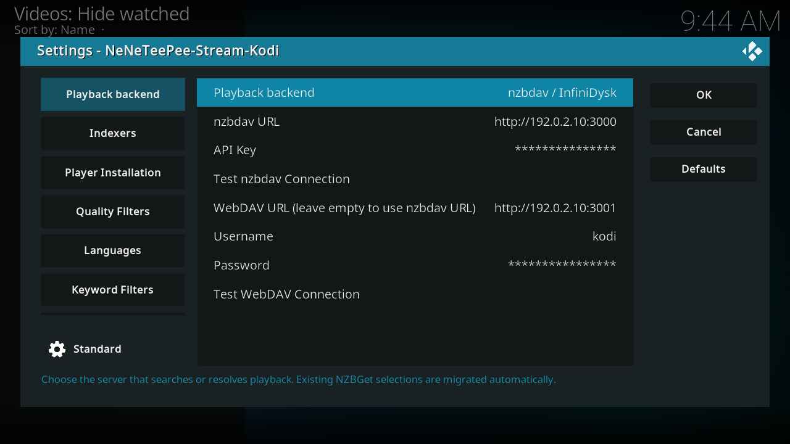

# Connect nzbdav or InfiniDysk

!!! note "Availability"
    The unified **Playback backend** section and StreamNZB support ship in
    Beta 2.0.0-beta.3. Stable 1.2.3 doesn't include them. It configures
    nzbdav and WebDAV under **Connection** and supports nzbdav only.

Use [nzbdav](https://github.com/nzbdav-dev/nzbdav) or [InfiniDysk](https://www.infinidysk.com/) for server installation and configuration instructions. Start with a running server that Kodi can reach.

This is a real Kodi screenshot from the captured `origin/main` build, using example values. See the [complete Playback backend settings](../settings/backend.md) for every option and commit-pinned source footnotes.

## Configure the add-on

1. Open **Playback backend** in the add-on settings.
2. Select **nzbdav / InfiniDysk**.
3. Enter the server URL and API key in the nzbdav fields.
4. Select **Test nzbdav Connection**.
5. Enter your WebDAV username and password.
6. Clear **WebDAV URL** to reuse the nzbdav address. If WebDAV uses a separate address, enter that address instead.
7. Select **Test WebDAV Connection**.
8. Configure a search provider on **Indexers**.
9. Save the settings and select a title through TMDBHelper.

The add-on submits the selected NZB, checks for an available video over WebDAV, and hands playback to its local proxy. The proxy supports seeking through HTTP Range requests. Remuxing requires optional ffmpeg support. See [playback](../features/playback-and-remux.md) and [fallback streams](../features/fallback-streams.md) for their settings and limits.
