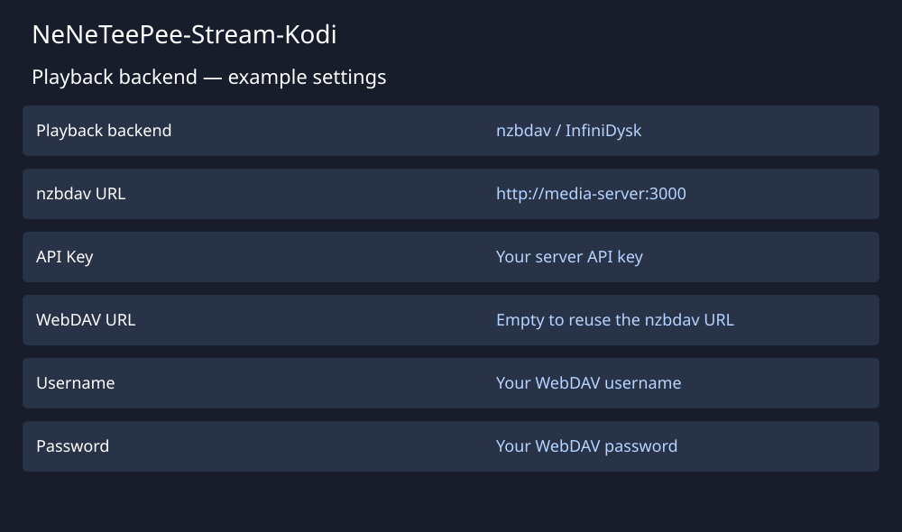

# Connect nzbdav or InfiniDysk

!!! note "Current source and next release"
    The unified **Playback backend** section and StreamNZB support are not in
    Stable 1.2.3 or Beta 2.0.0-beta.2. These instructions and illustrations
    describe current source builds and the next release.

    In released builds, configure nzbdav and WebDAV under **Connection**.
    Beta 2.0.0-beta.2 has a separate **NZBGet** section with an
    **Use NZBGet instead of nzbdav for playback** toggle. Stable 1.2.3 supports nzbdav only.
    StreamNZB requires a current source build until a release includes it.

Use [nzbdav](https://github.com/nzbdav-dev/nzbdav) or [InfiniDysk](https://github.com/infinidysk/infinidysk) for server installation and configuration instructions. Start with a running server that Kodi can reach.

The illustration shows example values, not a live configuration.

## Configure the add-on

1. Open **Playback backend** in the add-on settings.
2. Select **nzbdav / InfiniDysk**.
3. Enter the server URL and API key in the nzbdav fields.
4. Select **Test nzbdav Connection**.
5. Enter your WebDAV username and password.
6. Clear **WebDAV URL** to reuse the nzbdav address. If WebDAV uses a separate address, enter that address instead.
7. Select **Test WebDAV Connection**.
8. Configure a search provider on **Indexers**.
9. Save the settings and select a title through TMDBHelper.

The add-on submits the selected NZB, checks for an available video over WebDAV, and hands playback to its local proxy. The proxy supports seeking through HTTP Range requests. Remuxing requires optional ffmpeg support. See [playback](../features/playback-and-remux.md) and [fallback streams](../features/fallback-streams.md) for their settings and limits.
