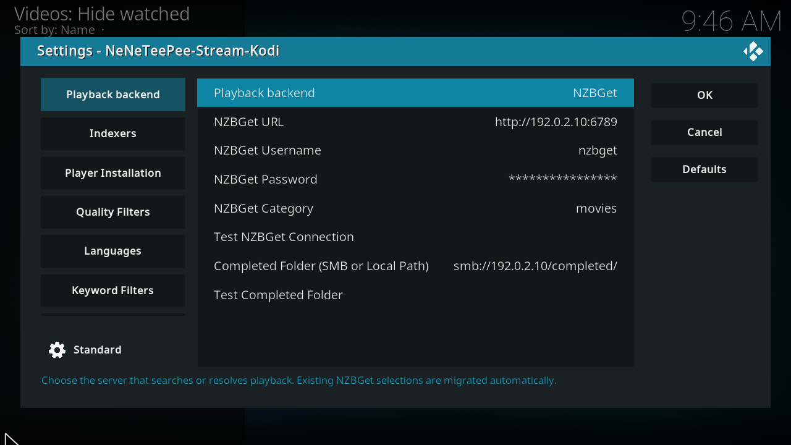

# Connect NZBGet

!!! note "Current source and next release"
    The unified **Playback backend** section and StreamNZB support are not in
    Stable 1.2.3 or Beta 2.0.0-beta.2. These instructions and screenshots
    describe current source builds and the next release.

    In released builds, configure nzbdav and WebDAV under **Connection**.
    Beta 2.0.0-beta.2 has a separate **NZBGet** section with an
    **Use NZBGet instead of nzbdav for playback** toggle. Stable 1.2.3 supports nzbdav only.
    StreamNZB requires a current source build until a release includes it.

Use [NZBGet](https://github.com/nzbgetcom/nzbget) for server installation and configuration instructions. Start with a running server that Kodi can reach.

This is a real Kodi screenshot from the captured `origin/main` build, using example values. See the [complete Playback backend settings](../settings/backend.md) for every option and commit-pinned source footnotes.

## Configure the add-on

1. Open **Playback backend** in the add-on settings.
2. Select **NZBGet**.
3. Enter the NZBGet URL, control username, and control password.
4. Enter a category if your server requires one.
5. Select **Test NZBGet Connection**.
6. Enter the completed folder as Kodi sees it. Use a mounted local path or an SMB URL.
7. Select **Test Completed Folder**.
8. Configure a search provider on **Indexers**.
9. Save the settings and select a title through TMDBHelper.

The completed folder must expose the files that NZBGet downloads. A path inside the server or its container might differ from the path Kodi can read.

The add-on waits for downloading and processing to finish, then plays the completed video. This backend does not use WebDAV or the local streaming proxy. See [NZBGet playback and download recovery](../features/nzbget-backend.md) for completed-folder mapping and Smart Duplicates behavior.

## Optional recovery fork

The [xbmc4lyfe fork and Debian package work](https://github.com/xbmc4lyfe/nzbget/tree/fork-ci) and [NZBGet recovery proposal #850](https://github.com/nzbgetcom/nzbget/pull/850) are separate from the [upstream NZBGet project](https://github.com/nzbget/nzbget). Follow the fork's build and package instructions if you choose it. Selecting NZBGet in Kodi neither installs the fork nor enables its server recovery features.
