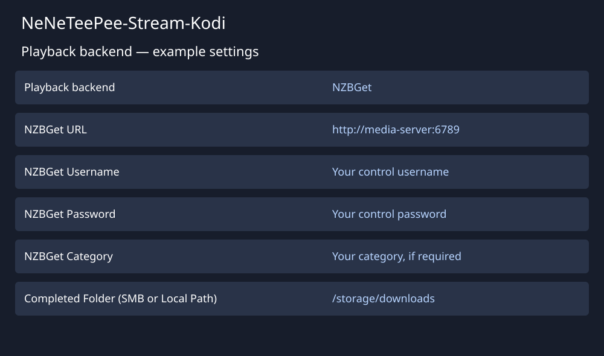

# Connect NZBGet

Use [NZBGet](https://github.com/nzbgetcom/nzbget) for server installation and configuration instructions. Start with a running server that Kodi can reach.

The illustration shows example values, not a live configuration.

## Configure the add-on

1. Open **Playback backend** in the add-on settings.
2. Select **NZBGet**.
3. Enter the NZBGet URL, control username, and control password.
4. Enter a category if your server requires one.
5. Select **Test NZBGet Connection**.
6. Enter the completed folder as Kodi sees it. Use a mounted local path or an SMB URL.
7. Select **Test Completed Folder**.
8. Configure a search provider on **Indexers**.
9. Save the settings and select a title through TMDBHelper.

The completed folder must expose the files that NZBGet downloads. A path inside the server or its container might differ from the path Kodi can read.

The add-on waits for downloading and processing to finish, then plays the completed video. This backend does not use WebDAV or the local streaming proxy. See [NZBGet playback and download recovery](../features/nzbget-backend.md) for completed-folder mapping and Smart Duplicates behavior.
