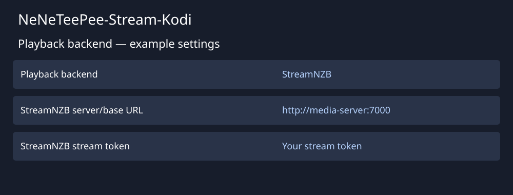

# Connect StreamNZB

Use [StreamNZB](https://github.com/Gaisberg/streamnzb) for server installation and configuration instructions. Start with a running server that Kodi can reach.

The illustration shows example values, not a live configuration.

## Configure the add-on

1. Open **Playback backend** in the add-on settings.
2. Select **StreamNZB**.
3. Enter the server base URL that Kodi can reach.
4. Enter your stream token. Use the stream token rather than dashboard administrator credentials.
5. Save the settings.
6. Select a movie or episode in TMDBHelper and choose the add-on player.
7. Select a release in the full release picker.

The add-on parses release filenames and applies your configured filters and sorting. Use the picker’s show-all option to view filtered entries.

StreamNZB manages searches, NZB retrieval, unpacking, and server recovery. The add-on sends the selected HTTP playback URL and request headers directly to Kodi. Local indexer settings, WebDAV settings and proxy fallback workers do not apply. Both the API address and the playback address returned by the server must be reachable from Kodi.

See [StreamNZB behavior and identity requirements](../features/streamnzb-backend.md) for supported entry points and recovery limits.
