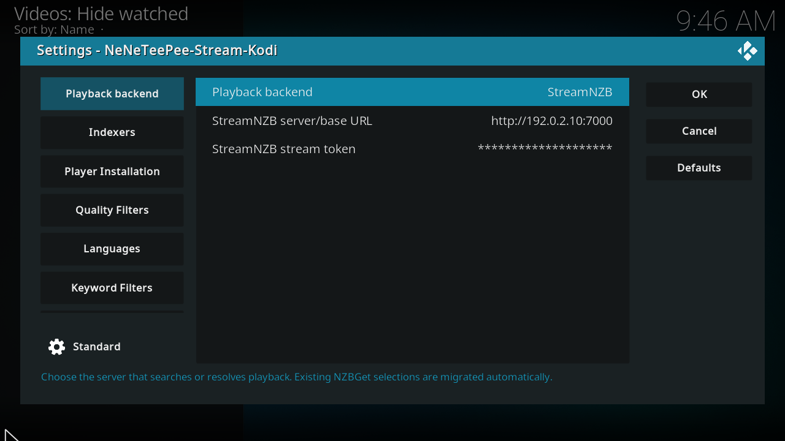

# Connect StreamNZB

!!! note "Availability"
    The unified **Playback backend** section and StreamNZB support ship in
    Beta 2.0.0-beta.3. Stable 1.2.3 doesn't include them. It configures
    nzbdav and WebDAV under **Connection** and supports nzbdav only.

Use [StreamNZB](https://github.com/Gaisberg/streamnzb) for server installation and configuration instructions. Start with a running server that Kodi can reach.

This is a real Kodi screenshot from the captured `origin/main` build, using example values. See the [complete Playback backend settings](../settings/backend.md) for every option and commit-pinned source footnotes.

## Configure the add-on

1. Open **Playback backend** in the add-on settings.
2. Select **StreamNZB**.
3. Enter the server base URL that Kodi can reach.
4. Enter your stream token. Use the stream token rather than dashboard administrator credentials.
5. Save the settings.
6. Select a movie or episode in TMDBHelper and choose the add-on player.
7. Select a release in the full release picker.

The add-on parses release filenames and applies your configured filters and sorting. Use the picker’s show-all option to view filtered entries.

StreamNZB manages searches, NZB retrieval, archive streaming, and server recovery. The add-on sends the selected HTTP playback URL and request headers directly to Kodi. Local indexer settings, WebDAV settings, and proxy fallback workers don't apply. Both the API address and the playback address returned by the server must be reachable from Kodi.

See [StreamNZB behavior and identity requirements](../features/streamnzb-backend.md) for supported entry points and recovery limits.

## Archive limits

StreamNZB streams supported RAR and 7z archives whose media is stored without compression. This backend can't stream compressed RAR and 7z releases; they require downloading and unpacking with a download client such as NZBGet or SABnzbd. See [StreamNZB’s supported formats](https://github.com/Gaisberg/streamnzb#what-can-and-cannot-be-streamed) for the upstream format restrictions.

## Recovery and preloading

In the StreamNZB dashboard, edit the stream and open its **Advanced** tab:

1. Turn on **Failover** to let the server try another release after playback failure.
2. Set **Same-release attempts** to **All copies** so copies supplied by different indexers remain available for recovery.
3. Set **Preloading** to **5 results** to prepare up to five search results before selection. Each preloaded result uses an indexer NZB download. This prepares candidates; it does not mean five guaranteed fallback streams.[^server-recovery]

These are StreamNZB v6.2.0 labels from the inspected server snapshot. There is no numeric **Fallback = 5** field in that screen. Kodi's **Advanced → Maximum standby fallback streams = 5** controls nzbdav / InfiniDysk proxy backups only, and does not configure StreamNZB. See [Advanced settings](../settings/advanced.md) for that separate option.

If NZBHydra2 is StreamNZB's only indexer endpoint, open Hydra's advanced **Searching** settings and set **Duplicate detection → Duplicate age threshold** to **-1**. This keeps Hydra from suppressing copies that StreamNZB could use for recovery. It affects all Hydra clients. See [the Hydra duplicate explanation](../features/streamnzb-backend.md#nzbhydra2-as-the-only-streamnzb-indexer) for the version-specific behavior and timeout guidance.

[^server-recovery]: [StreamNZB Failover and Same-release attempts at the inspected commit](https://github.com/Gaisberg/streamnzb/blob/c5aa001b0051c0f866768e30c97292c7d1a6c216/frontend/src/components/StreamManagement.jsx#L632); [Preloading choices and API-download cost](https://github.com/Gaisberg/streamnzb/blob/c5aa001b0051c0f866768e30c97292c7d1a6c216/frontend/src/components/StreamManagement.jsx#L677). These server settings are independent of the Kodi add-on's local fallback worker. Seamless midstream recovery in Kodi has not been verified.
