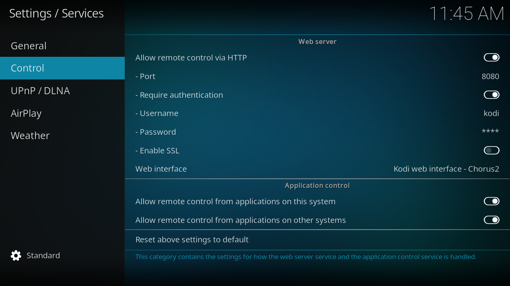

# Copy and paste from your phone

Use a Kodi remote app to paste long API keys, usernames, and passwords into Kodi's text-entry dialog. This avoids entering them one character at a time with a television remote.

## Turn on remote control

1. Connect Kodi and your phone to the same local network.
2. Open Kodi **Settings → Services → Control**. This is under Services, rather than the System settings used for Unknown sources.
3. Turn on **Allow remote control via HTTP**. Note the port, such as `8080`.
4. Keep **Require authentication** on and set a **Username** and **Password** for remote control. These authenticate HTTP requests to Kodi; they are separate from backend credentials.
5. Turn on **Allow remote control from applications on this system** and **Allow remote control from applications on other systems** for the phone remote workflow. Kodi's [phone remote setup guide](https://kodi.wiki/view/Smartphone/tablet_remotes#Quick_set_up_guide) identifies the other-systems control as the basic remote-control switch.

The remote app interfaces use JSON-RPC over TCP/WebSocket and EventServer without authentication. The HTTP username and password do not protect those interfaces. Allow access only from your trusted local network, and never expose them to the internet. Kodi's [Control reference](https://kodi.wiki/view/Settings/Services/Control#Allow_remote_control_from_applications_on_other_systems) explains the difference.

## Paste a value

1. Install [Official Kodi Remote for iOS](https://github.com/xbmc/Official-Kodi-Remote-iOS) or [Kore for Android](https://github.com/xbmc/Kore), following the project's app-store link.
2. Add your Kodi host using its local IP address, HTTP port, and the remote-control username and password. Use the app's discovery feature if it finds your device.
3. In Kodi, select the field you want to edit, such as **API Key**, to open its keyboard dialog.
4. Copy the value on your phone. Open the remote app's keyboard or text-entry control, paste the value, and send it to Kodi. The control name varies between apps.
5. Confirm the text-entry dialog, then select **OK** in the add-on settings to save it.

Masked fields remain masked in Kodi. Check that you copied the whole value and did not include spaces at either end. Remote control sends text to the active Kodi input field; open the intended field before sending it.
