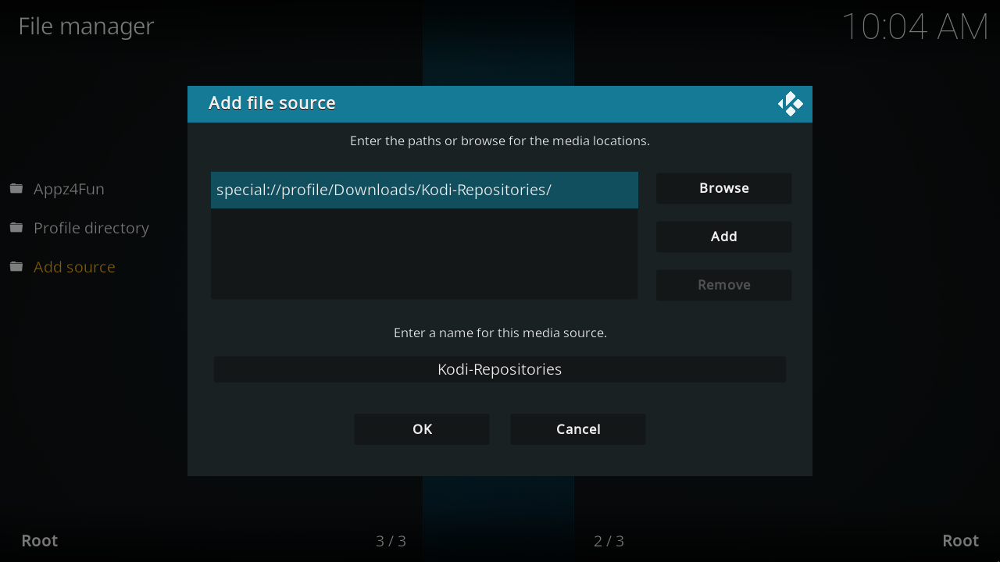
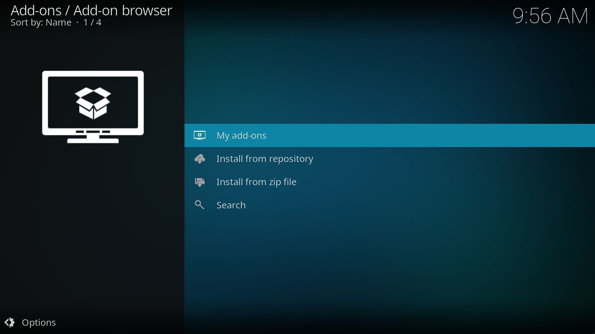
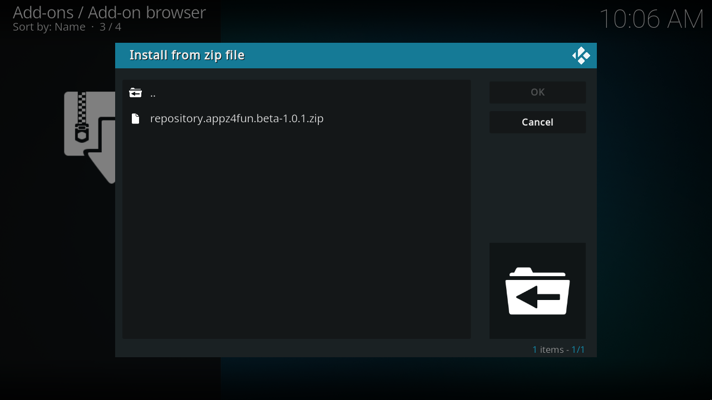
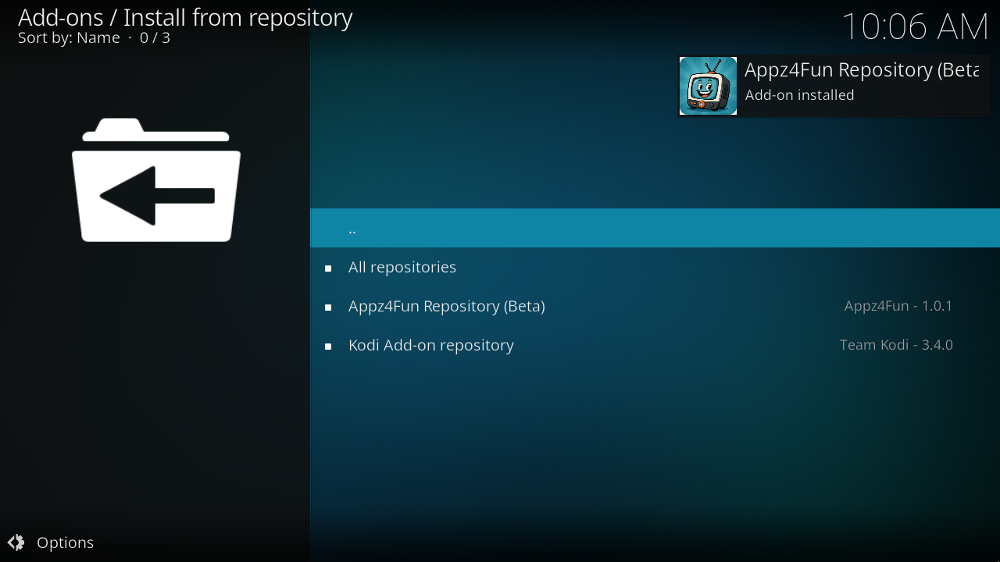
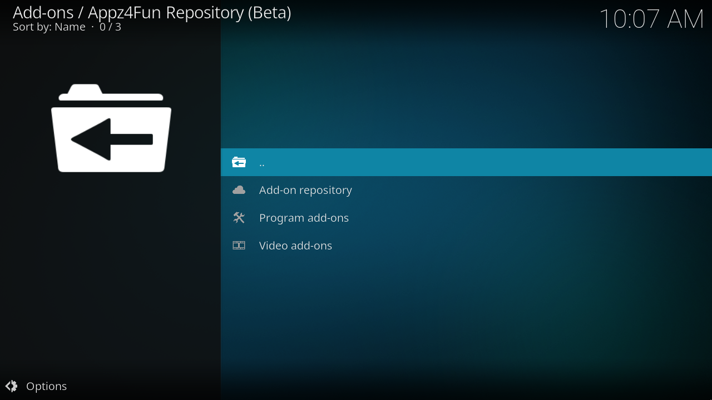
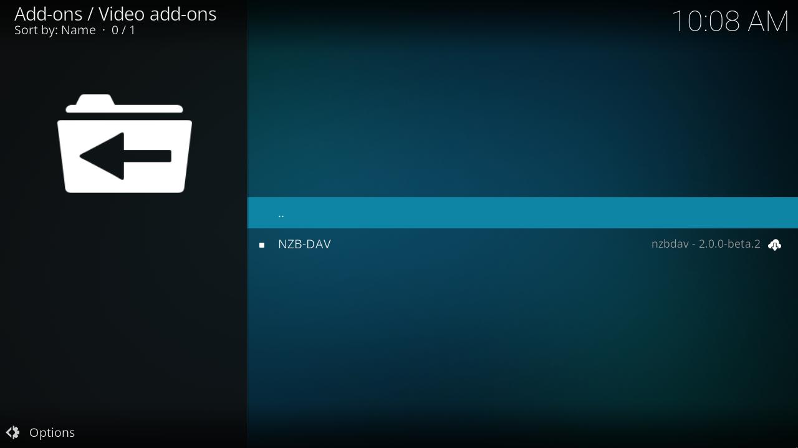
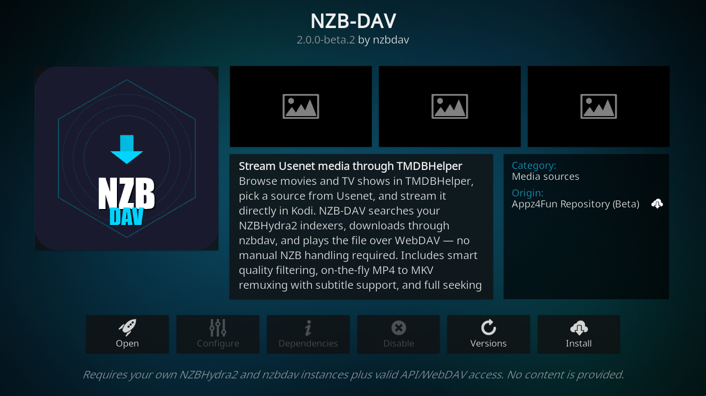
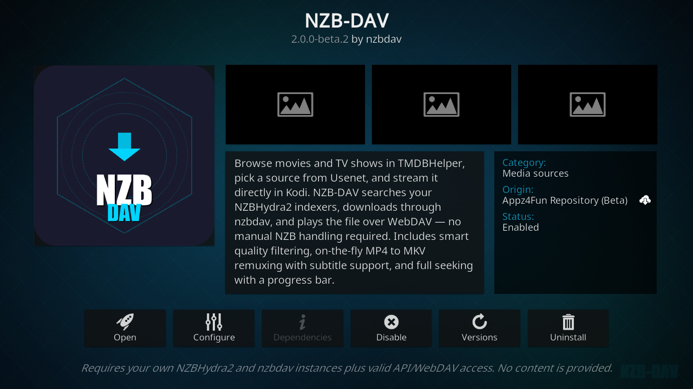

# Install through the Beta repository

The [Appz4Fun Kodi Repository project](https://github.com/Appz4Fun/Appz4Fun-Kodi-Repo) publishes Stable and Beta channels. Install the repository add-on ZIP first, then install the video add-on from that repository. These are two different ZIPs: the repository ZIP supplies the catalog and updates; the video add-on ZIP supplies the player.

!!! note "Upcoming name and feature changes"
    The repository captured on October 3, 2026 serves **NZB-DAV 2.0.0-beta.2** in the Beta channel. The next release changes the displayed name to **NeNeTeePee-Stream-Kodi** after a release includes the rename. The ID remains `plugin.video.nzbdav`.

    The [settings screenshots](../settings/index.md) show current `main`, not this released beta. The unified backend tab and StreamNZB support are not included in 2.0.0-beta.2. Use a current source build for those features until a release includes them.

## Download the repository ZIP

1. Open the [repository download page](https://appz4fun.github.io/Appz4Fun-Kodi-Repo/) on your Kodi device or another computer.
2. Download the **Beta** repository ZIP. At capture time it is `repository.appz4fun.beta-1.0.1.zip`; use the version offered by the download page.
3. Put the ZIP in a folder Kodi can browse. Copy it to the device, a USB drive, or an accessible network share. The VM example uses a folder named **Kodi-Repositories** under Kodi's profile Downloads folder.

The Pages landing page works in a web browser, but Kodi's HTTP directory browser showed no ZIPs from its root during this walkthrough. Download the ZIP first rather than relying on that URL as a browsable file source.

## Add the folder in File manager

1. Open Kodi **Settings → File manager → Add source**.
2. Select **Browse** and choose the folder containing your downloaded ZIP. You can also select **None** and enter a local or network folder path.
3. Enter a name such as **Kodi-Repositories** and select **OK**.

The screenshot uses `special://profile/Downloads/Kodi-Repositories/`, Kodi's alias for a folder inside the active profile. It works only after the ZIP has been copied there. Use the actual folder you downloaded or copied to on your device. Adding a file source does not install a repository or an add-on.

## Install the repository from its ZIP

1. Open **Settings → System → Add-ons** and turn on **Unknown sources**. Confirm Kodi's prompt for third-party add-ons.
2. Open **Settings → Add-ons → Install from zip file**.
3. Select the file source or folder you added, then select the Beta repository ZIP.
4. Wait for the **Appz4Fun Repository (Beta): Add-on installed** notification.

## Install the video add-on from the Beta repository

1. Open **Install from repository** in the add-on browser.
2. Select **Appz4Fun Repository (Beta)**.
3. Select **Video add-ons**.
4. Select **NZB-DAV**, then **Install**. Accept the dependency installation prompt if Kodi shows one. If replacing a manual installation, Kodi can ask whether to replace it; keep your add-on data when prompted.
5. Wait for installation to finish. Kodi now tracks updates from that repository.

The VM walkthrough installed both the Beta repository ZIP and the released video add-on. The current source build was restored afterward to capture the newer settings. This verifies the installation steps separately from the unreleased settings layout.

## Open the add-on settings

Open **Settings → Add-ons → My add-ons → Video add-ons → NZB-DAV → Configure**. After the renamed release, select **NeNeTeePee-Stream-Kodi** in the same location.

You can also open **Add-ons → Video add-ons**, open the add-on's context menu, and select **Settings**. Select **OK** after editing to save your configuration. Continue with [backend services](../backends/index.md), the [settings guide](../settings/index.md), and the required [TMDBHelper setup](tmdbhelper.md).

## Stable and channel switching

**Appz4Fun Repository** is the Stable channel. **Appz4Fun Repository (Beta)** includes prereleases. Use the channel you intend to receive updates from. Existing manual or legacy-repository installations may need **Versions** or **Update** on the add-on information page to select the package from the new repository. See [installation and migration](installation.md) for the full migration procedure.
