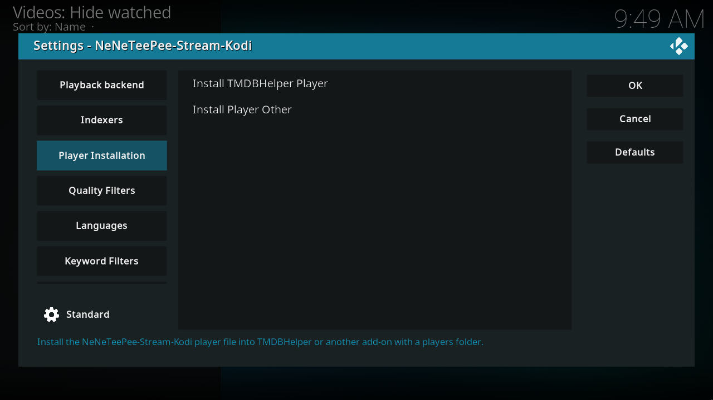

# Set up TMDBHelper

Current released packages (Stable 1.2.3 and Beta 2.0.0-beta.2) use the Kodi menu name **NZB-DAV**. In those builds, choose that name wherever these instructions show **NeNeTeePee-Stream-Kodi**. Renamed source builds use the new name.

[TMDBHelper](https://github.com/jurialmunkey/plugin.video.themoviedb.helper) is required for this title-browsing workflow. NeNeTeePee-Stream-Kodi plays titles you choose in TMDBHelper. To connect the two, you
install a NeNeTeePee-Stream-Kodi *player file* into TMDBHelper and set it as your default
player.

## Install the player file

1. Make sure TMDBHelper is installed and you've
   [configured NeNeTeePee-Stream-Kodi's connections](configuration.md).
2. In NeNeTeePee-Stream-Kodi settings, open the **Player Installation** tab.
3. Select **Install TMDBHelper Player**.

This writes a small `nzbdav.json` player file into TMDBHelper's players folder
(`addon_data/plugin.video.themoviedb.helper/players/`) and registers
**NeNeTeePee-Stream-Kodi** as a selectable playback source. It also turns on TMDBHelper's
`only_resolve_strm` setting. Without that setting, TMDBHelper doesn't run
NeNeTeePee-Stream-Kodi's script action directly (see [Why NeNeTeePee-Stream-Kodi uses a script player](#why-neneteepee-stream-kodi-uses-a-script-player)).
You get a **Player installed to: TMDBHelper** notification.

NeNeTeePee-Stream-Kodi protects your data while doing this:

- It refuses to write anywhere outside Kodi's add-on data folder.
- If a player file with the same schema version is already present, NeNeTeePee-Stream-Kodi
  keeps it as is, so your manual edits survive. NeNeTeePee-Stream-Kodi backs up a file from an
  older schema version to `nzbdav.bak` and then replaces it. If it can't write
  the backup, the install stops and your existing file stays in place.
- If the write fails, you get a **Failed to install to: …** message instead of
  a false success.

!!! tip "Re-run the install after updating NeNeTeePee-Stream-Kodi"
    Updating the add-on doesn't update an installed player file. Select
    **Install TMDBHelper Player** again after an update to pick up player file
    changes.

See [every player installation option](../settings/player-installation.md) for commit-pinned installer references.

### Install into another add-on's player list

If you use a different front end that reads TMDBHelper-style player files,
select **Install Player Other** on the same tab. NeNeTeePee-Stream-Kodi scans Kodi's add-on
data folders (`addon_data/*/players/`) for add-ons that already have a
`players` folder, apart from TMDBHelper and NeNeTeePee-Stream-Kodi itself. It lists them and
installs `nzbdav.json` into the one you choose, with the same safeguards as
preceding. There's no fixed list of supported add-ons. If no add-on has a
`players` folder yet, you get a notification and nothing is written. This
route doesn't change any setting in the other add-on.

## Set NeNeTeePee-Stream-Kodi as your default player

1. Restart Kodi, **or** open TMDBHelper and select **Players → Update players**.
2. In TMDBHelper settings, set **Default player (Movies)** and **Default player
   (TV Shows)** to **NeNeTeePee-Stream-Kodi**.

The add-on's [optional TMDB API key](tmdb-api.md) belongs to its Indexers settings. It is separate from the player selection and TMDBHelper's own API settings.

## Why NeNeTeePee-Stream-Kodi uses a script player

The NeNeTeePee-Stream-Kodi player file launches playback with a `RunScript` action instead of a
`plugin://` URL. This is deliberate: on CoreELEC and Kodi 21, asking Kodi to
open a `plugin://` URL as a playable item can crash the player before NeNeTeePee-Stream-Kodi's
code even runs. `RunScript` enters the add-on directly, shows the source picker,
and then starts playback. You don't need to
configure anything for this; the installed player file already does it.

## Verify

Open any movie or episode in TMDBHelper and start playback. If the NeNeTeePee-Stream-Kodi
source picker appears, setup is complete. If **NeNeTeePee-Stream-Kodi** doesn't show up as a
player, see
[Troubleshooting → NeNeTeePee-Stream-Kodi doesn't appear in TMDBHelper](../operations/troubleshooting.md).

## Next step

[Play your first title](first-playback.md).

## Refresh the player name

If TMDBHelper still shows the old add-on name, run the player installation action again. The installer backs up the previous player file before replacing it with the renamed player. The add-on ID and playback routes stay the same.
