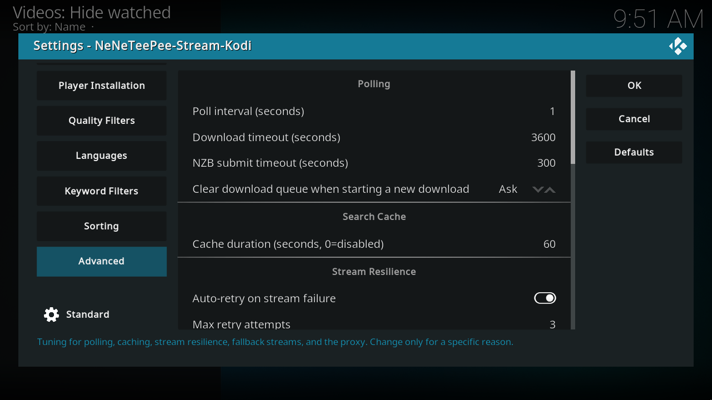
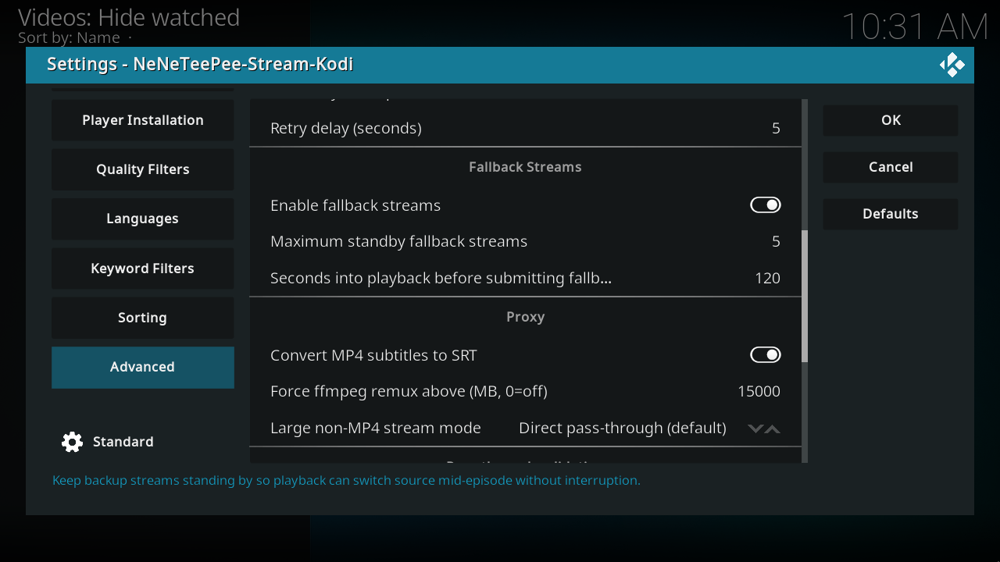
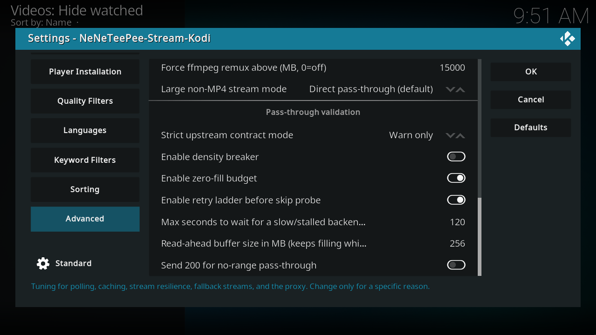

# Advanced

These options tune the add-on resolver and proxy. They do not change StreamNZB server recovery, and the NZBGet completed file does not use the WebDAV proxy. Keep the defaults until you have a specific playback problem. Local fallback uses strict donor validation before switching sources. EBML-aware concealment applies to MKV/WebM only when container boundaries are verified; it cannot reconstruct missing frames. Payload-only gaps or unverified structure can still receive plain zeros. See [fallback streams](../features/fallback-streams.md) and [playback and remux](../features/playback-and-remux.md).

## Kodi screenshots

Captured on the OrbStack Kodi VM from commit `db07f61`. Debug overlays are off, and credentials use example values. [Capture details](index.md#capture-details).

## Every option

### Polling

| Option and setting ID | Default | What it does |
| --- | --- | --- |
| Poll interval (seconds)[^source-poll_interval] `poll_interval` | 1 | Seconds between checks of the download's status. Clamped to 1-60. |
| Download timeout (seconds)[^source-download_timeout] `download_timeout` | 3600 | Give up waiting for the download to become ready after this many seconds. Clamped to 60-86400. |
| NZB submit timeout (seconds)[^source-submit_timeout] `submit_timeout` | 300 | Max seconds to wait for nzbdav to accept the submitted NZB (it fetches and parses the NZB before replying). Clamped to 5-600. |
| Clear download queue when starting a new download[^source-clear_queue_on_submit] `clear_queue_on_submit` | Ask | Whether to clear other in-progress downloads before starting a new one. Never clears this title's own in-flight job or a completed copy you're about to reuse. Choices: 0 = Ask, 1 = Always clear, 2 = Never. |

### Search cache

| Option and setting ID | Default | What it does |
| --- | --- | --- |
| Cache duration (seconds, 0=disabled)[^source-cache_ttl] `cache_ttl` | 60 | Cache raw search results for this many seconds. 0 turns caching off; runtime values are clamped to 0–86400. Filter and sorting changes still apply to cached results. TMDBHelper playback requests a fresh search. |

### Stream resilience

| Option and setting ID | Default | What it does |
| --- | --- | --- |
| Auto-retry on stream failure[^source-stream_auto_retry] `stream_auto_retry` | On | Enable the local playback retry monitor. It retries failed playback from the recorded position when recovery information is available. StreamNZB does not start this monitor. |
| Max retry attempts[^source-stream_max_retries] `stream_max_retries` | 3 | Limit local playback retry attempts. Runtime values are clamped to 0–10. This does not configure StreamNZB server attempts. |
| Retry delay (seconds)[^source-stream_retry_delay] `stream_retry_delay` | 5 | Wait this many seconds before a local playback retry. Runtime values are clamped to 1–300. This does not configure StreamNZB server delays. |

### Fallback streams

| Option and setting ID | Default | What it does |
| --- | --- | --- |
| Enable fallback streams[^source-fallback_streams_enabled] `fallback_streams_enabled` | On | Allow the nzbdav / InfiniDysk proxy to prepare validated backup streams and try another source when the current source fails. This does not guarantee an uninterrupted switch and does not control StreamNZB. |
| Maximum standby fallback streams[^source-fallback_streams_max] `fallback_streams_max` | 5 | How many standby fallback streams to keep ready per title. Hard ceiling of 5. |
| Seconds into playback before submitting fallback backups[^source-fallback_submit_delay] `fallback_submit_delay` | 120 | Seconds into playback to wait before submitting fallback backups. 0 submits immediately. |

### Proxy

| Option and setting ID | Default | What it does |
| --- | --- | --- |
| Convert MP4 subtitles to SRT[^source-proxy_convert_subs] `proxy_convert_subs` | On | Convert MP4 mov_text subtitles to SRT during remux so embedded subtitles survive. |
| Force ffmpeg remux above (MB, 0=off)[^source-force_remux_threshold_mb] `force_remux_threshold_mb` | 15000 | Apply the selected remux mode to files larger than this size in MB. 0 turns off this size-triggered remux rule. |
| Large non-MP4 stream mode[^source-force_remux_mode] `force_remux_mode` | Direct pass-through (default) | How to handle large non-MP4 streams: pass through directly, remux to fMP4/HLS, or remux to Matroska for compatibility. Choices: 0 = Direct pass-through (default), 1 = fMP4 HLS (compatibility, experimental), 2 = Matroska remux (compatibility). |
| force_remux_mode_v2_migrated[^source-force_remux_mode_v2_migrated] `force_remux_mode_v2_migrated` | Off | Hidden one-time migration flag for remux-mode settings. The add-on manages it; do not change it manually. Hidden from the settings dialog. |

### Pass-through validation

| Option and setting ID | Default | What it does |
| --- | --- | --- |
| Strict upstream contract mode[^source-strict_contract_mode] `strict_contract_mode` | Warn only | How to react when the upstream server violates the expected Range/Content-Length contract. Off also disables the density breaker below. Choices: 0 = Off, 1 = Warn only, 2 = Enforce. |
| Enable density breaker[^source-density_breaker_enabled] `density_breaker_enabled` | Off | Stop a stream early if a rolling 16MB window becomes more than half zero-filled, which usually means a dead release. Only active when Strict upstream contract mode isn't Off. |
| Enable zero-fill budget[^source-zero_fill_budget_enabled] `zero_fill_budget_enabled` | On | Limit the total concealed missing data in a proxy stream. When the budget is exhausted, stop with an error. For validated MKV/WebM boundaries, the proxy can write correctly sized EBML Void elements while preserving byte offsets. Missing payload or unknown structure can still use plain zeros; no missing frames are reconstructed. |
| Enable retry ladder before skip probe[^source-retry_ladder_enabled] `retry_ladder_enabled` | On | Re-issue the original range request with backoff on transient upstream errors before falling back to skip-filling. |
| Max seconds to wait for a slow/stalled backend before giving up (0=off)[^source-passthrough_stall_wait] `passthrough_stall_wait` | 120 | Max seconds to hold an established stream open through a recoverable backend stall before giving up. 0 closes immediately. Clamped to 0-600. |
| Read-ahead buffer size in MB (keeps filling while paused; 0=off)[^source-readahead_buffer_mb] `readahead_buffer_mb` | 256 | Size in MB of the per-session forward read-ahead buffer. Keeps filling while paused. 0 disables it. Clamped to 0-4096. |
| Send 200 for no-range pass-through[^source-send_200_no_range] `send_200_no_range` | Off | Send 200 OK instead of 206 Partial Content when Kodi requests the whole file without a Range header. Leave off unless validated on your build. |
| cache_warning_shown[^source-cache_warning_shown] `cache_warning_shown` | Off | Hidden state recording whether the cache warning has been shown. The add-on manages it. Hidden from the settings dialog. |
| cache_dialog_dismissed[^source-cache_dialog_dismissed] `cache_dialog_dismissed` | Off | Hidden state recording dismissal of the cache dialog. The add-on manages it. Hidden from the settings dialog. |
| webdav_content_root[^source-webdav_content_root] `webdav_content_root` | Empty | Hidden override for the WebDAV content-root path. Empty uses content. Use only when a reverse proxy or server exposes a different content root. Hidden from the settings dialog. |

## Source notes

Labels and schema defaults are from commit [`db07f61`](https://github.com/Appz4Fun/NeNeTeePee-Stream-Kodi/blob/db07f61d4090a0c89ec8461ee9b3ca34f9607aa6/repo/plugin.video.nzbdav/resources/settings.xml). Runtime limits can differ from the editable schema; the explanations identify those limits. Links use the full commit ID, so later changes to `main` do not move them.

[^source-poll_interval]: [Setting declaration](https://github.com/Appz4Fun/NeNeTeePee-Stream-Kodi/blob/db07f61d4090a0c89ec8461ee9b3ca34f9607aa6/repo/plugin.video.nzbdav/resources/settings.xml#L1340); [runtime reference](https://github.com/Appz4Fun/NeNeTeePee-Stream-Kodi/blob/db07f61d4090a0c89ec8461ee9b3ca34f9607aa6/repo/plugin.video.nzbdav/resources/lib/nzbget_resolver_dupes.py#L799).
[^source-download_timeout]: [Setting declaration](https://github.com/Appz4Fun/NeNeTeePee-Stream-Kodi/blob/db07f61d4090a0c89ec8461ee9b3ca34f9607aa6/repo/plugin.video.nzbdav/resources/settings.xml#L1347); [runtime reference](https://github.com/Appz4Fun/NeNeTeePee-Stream-Kodi/blob/db07f61d4090a0c89ec8461ee9b3ca34f9607aa6/repo/plugin.video.nzbdav/resources/lib/nzbget_resolver.py#L436).
[^source-submit_timeout]: [Setting declaration](https://github.com/Appz4Fun/NeNeTeePee-Stream-Kodi/blob/db07f61d4090a0c89ec8461ee9b3ca34f9607aa6/repo/plugin.video.nzbdav/resources/settings.xml#L1354); [runtime reference](https://github.com/Appz4Fun/NeNeTeePee-Stream-Kodi/blob/db07f61d4090a0c89ec8461ee9b3ca34f9607aa6/repo/plugin.video.nzbdav/resources/lib/nzbdav_api.py#L107).
[^source-clear_queue_on_submit]: [Setting declaration](https://github.com/Appz4Fun/NeNeTeePee-Stream-Kodi/blob/db07f61d4090a0c89ec8461ee9b3ca34f9607aa6/repo/plugin.video.nzbdav/resources/settings.xml#L1361); [runtime reference](https://github.com/Appz4Fun/NeNeTeePee-Stream-Kodi/blob/db07f61d4090a0c89ec8461ee9b3ca34f9607aa6/repo/plugin.video.nzbdav/resources/lib/resolver_queueclear.py#L29).
[^source-cache_ttl]: [Setting declaration](https://github.com/Appz4Fun/NeNeTeePee-Stream-Kodi/blob/db07f61d4090a0c89ec8461ee9b3ca34f9607aa6/repo/plugin.video.nzbdav/resources/settings.xml#L1375); [runtime reference](https://github.com/Appz4Fun/NeNeTeePee-Stream-Kodi/blob/db07f61d4090a0c89ec8461ee9b3ca34f9607aa6/repo/plugin.video.nzbdav/resources/lib/cache.py#L62).
[^source-stream_auto_retry]: [Setting declaration](https://github.com/Appz4Fun/NeNeTeePee-Stream-Kodi/blob/db07f61d4090a0c89ec8461ee9b3ca34f9607aa6/repo/plugin.video.nzbdav/resources/settings.xml#L1384); [runtime reference](https://github.com/Appz4Fun/NeNeTeePee-Stream-Kodi/blob/db07f61d4090a0c89ec8461ee9b3ca34f9607aa6/repo/plugin.video.nzbdav/service.py#L190).
[^source-stream_max_retries]: [Setting declaration](https://github.com/Appz4Fun/NeNeTeePee-Stream-Kodi/blob/db07f61d4090a0c89ec8461ee9b3ca34f9607aa6/repo/plugin.video.nzbdav/resources/settings.xml#L1389); [runtime reference](https://github.com/Appz4Fun/NeNeTeePee-Stream-Kodi/blob/db07f61d4090a0c89ec8461ee9b3ca34f9607aa6/repo/plugin.video.nzbdav/service.py#L194).
[^source-stream_retry_delay]: [Setting declaration](https://github.com/Appz4Fun/NeNeTeePee-Stream-Kodi/blob/db07f61d4090a0c89ec8461ee9b3ca34f9607aa6/repo/plugin.video.nzbdav/resources/settings.xml#L1396); [runtime reference](https://github.com/Appz4Fun/NeNeTeePee-Stream-Kodi/blob/db07f61d4090a0c89ec8461ee9b3ca34f9607aa6/repo/plugin.video.nzbdav/service.py#L198).
[^source-fallback_streams_enabled]: [Setting declaration](https://github.com/Appz4Fun/NeNeTeePee-Stream-Kodi/blob/db07f61d4090a0c89ec8461ee9b3ca34f9607aa6/repo/plugin.video.nzbdav/resources/settings.xml#L1405); [runtime reference](https://github.com/Appz4Fun/NeNeTeePee-Stream-Kodi/blob/db07f61d4090a0c89ec8461ee9b3ca34f9607aa6/repo/plugin.video.nzbdav/resources/lib/fallback_streams_select.py#L34).
[^source-fallback_streams_max]: [Setting declaration](https://github.com/Appz4Fun/NeNeTeePee-Stream-Kodi/blob/db07f61d4090a0c89ec8461ee9b3ca34f9607aa6/repo/plugin.video.nzbdav/resources/settings.xml#L1410); [runtime reference](https://github.com/Appz4Fun/NeNeTeePee-Stream-Kodi/blob/db07f61d4090a0c89ec8461ee9b3ca34f9607aa6/repo/plugin.video.nzbdav/resources/lib/fallback_streams_select.py#L35).
[^source-fallback_submit_delay]: [Setting declaration](https://github.com/Appz4Fun/NeNeTeePee-Stream-Kodi/blob/db07f61d4090a0c89ec8461ee9b3ca34f9607aa6/repo/plugin.video.nzbdav/resources/settings.xml#L1417); [runtime reference](https://github.com/Appz4Fun/NeNeTeePee-Stream-Kodi/blob/db07f61d4090a0c89ec8461ee9b3ca34f9607aa6/repo/plugin.video.nzbdav/resources/lib/resolver_fallback.py#L381).
[^source-proxy_convert_subs]: [Setting declaration](https://github.com/Appz4Fun/NeNeTeePee-Stream-Kodi/blob/db07f61d4090a0c89ec8461ee9b3ca34f9607aa6/repo/plugin.video.nzbdav/resources/settings.xml#L1426); [runtime reference](https://github.com/Appz4Fun/NeNeTeePee-Stream-Kodi/blob/db07f61d4090a0c89ec8461ee9b3ca34f9607aa6/repo/plugin.video.nzbdav/resources/lib/stream_proxy_const.py#L323).
[^source-force_remux_threshold_mb]: [Setting declaration](https://github.com/Appz4Fun/NeNeTeePee-Stream-Kodi/blob/db07f61d4090a0c89ec8461ee9b3ca34f9607aa6/repo/plugin.video.nzbdav/resources/settings.xml#L1431); [runtime reference](https://github.com/Appz4Fun/NeNeTeePee-Stream-Kodi/blob/db07f61d4090a0c89ec8461ee9b3ca34f9607aa6/repo/plugin.video.nzbdav/resources/lib/stream_proxy_const.py#L315).
[^source-force_remux_mode]: [Setting declaration](https://github.com/Appz4Fun/NeNeTeePee-Stream-Kodi/blob/db07f61d4090a0c89ec8461ee9b3ca34f9607aa6/repo/plugin.video.nzbdav/resources/settings.xml#L1438); [runtime reference](https://github.com/Appz4Fun/NeNeTeePee-Stream-Kodi/blob/db07f61d4090a0c89ec8461ee9b3ca34f9607aa6/repo/plugin.video.nzbdav/resources/lib/stream_proxy_const.py#L316).
[^source-force_remux_mode_v2_migrated]: [Setting declaration](https://github.com/Appz4Fun/NeNeTeePee-Stream-Kodi/blob/db07f61d4090a0c89ec8461ee9b3ca34f9607aa6/repo/plugin.video.nzbdav/resources/settings.xml#L1450); [runtime reference](https://github.com/Appz4Fun/NeNeTeePee-Stream-Kodi/blob/db07f61d4090a0c89ec8461ee9b3ca34f9607aa6/repo/plugin.video.nzbdav/resources/lib/stream_proxy_const.py#L317).
[^source-strict_contract_mode]: [Setting declaration](https://github.com/Appz4Fun/NeNeTeePee-Stream-Kodi/blob/db07f61d4090a0c89ec8461ee9b3ca34f9607aa6/repo/plugin.video.nzbdav/resources/settings.xml#L1458); [runtime reference](https://github.com/Appz4Fun/NeNeTeePee-Stream-Kodi/blob/db07f61d4090a0c89ec8461ee9b3ca34f9607aa6/repo/plugin.video.nzbdav/resources/lib/stream_proxy_const.py#L318).
[^source-density_breaker_enabled]: [Setting declaration](https://github.com/Appz4Fun/NeNeTeePee-Stream-Kodi/blob/db07f61d4090a0c89ec8461ee9b3ca34f9607aa6/repo/plugin.video.nzbdav/resources/settings.xml#L1470); [runtime reference](https://github.com/Appz4Fun/NeNeTeePee-Stream-Kodi/blob/db07f61d4090a0c89ec8461ee9b3ca34f9607aa6/repo/plugin.video.nzbdav/resources/lib/stream_proxy_const.py#L319).
[^source-zero_fill_budget_enabled]: [Setting declaration](https://github.com/Appz4Fun/NeNeTeePee-Stream-Kodi/blob/db07f61d4090a0c89ec8461ee9b3ca34f9607aa6/repo/plugin.video.nzbdav/resources/settings.xml#L1475); [runtime reference](https://github.com/Appz4Fun/NeNeTeePee-Stream-Kodi/blob/db07f61d4090a0c89ec8461ee9b3ca34f9607aa6/repo/plugin.video.nzbdav/resources/lib/stream_proxy_const.py#L320).
[^source-retry_ladder_enabled]: [Setting declaration](https://github.com/Appz4Fun/NeNeTeePee-Stream-Kodi/blob/db07f61d4090a0c89ec8461ee9b3ca34f9607aa6/repo/plugin.video.nzbdav/resources/settings.xml#L1480); [runtime reference](https://github.com/Appz4Fun/NeNeTeePee-Stream-Kodi/blob/db07f61d4090a0c89ec8461ee9b3ca34f9607aa6/repo/plugin.video.nzbdav/resources/lib/stream_proxy_const.py#L321).
[^source-passthrough_stall_wait]: [Setting declaration](https://github.com/Appz4Fun/NeNeTeePee-Stream-Kodi/blob/db07f61d4090a0c89ec8461ee9b3ca34f9607aa6/repo/plugin.video.nzbdav/resources/settings.xml#L1485); [runtime reference](https://github.com/Appz4Fun/NeNeTeePee-Stream-Kodi/blob/db07f61d4090a0c89ec8461ee9b3ca34f9607aa6/repo/plugin.video.nzbdav/resources/lib/stream_proxy_const.py#L328).
[^source-readahead_buffer_mb]: [Setting declaration](https://github.com/Appz4Fun/NeNeTeePee-Stream-Kodi/blob/db07f61d4090a0c89ec8461ee9b3ca34f9607aa6/repo/plugin.video.nzbdav/resources/settings.xml#L1492); [runtime reference](https://github.com/Appz4Fun/NeNeTeePee-Stream-Kodi/blob/db07f61d4090a0c89ec8461ee9b3ca34f9607aa6/repo/plugin.video.nzbdav/resources/lib/stream_proxy_const.py#L324).
[^source-send_200_no_range]: [Setting declaration](https://github.com/Appz4Fun/NeNeTeePee-Stream-Kodi/blob/db07f61d4090a0c89ec8461ee9b3ca34f9607aa6/repo/plugin.video.nzbdav/resources/settings.xml#L1499); [runtime reference](https://github.com/Appz4Fun/NeNeTeePee-Stream-Kodi/blob/db07f61d4090a0c89ec8461ee9b3ca34f9607aa6/repo/plugin.video.nzbdav/resources/lib/stream_proxy_const.py#L322).
[^source-cache_warning_shown]: [Setting declaration](https://github.com/Appz4Fun/NeNeTeePee-Stream-Kodi/blob/db07f61d4090a0c89ec8461ee9b3ca34f9607aa6/repo/plugin.video.nzbdav/resources/settings.xml#L1504).
[^source-cache_dialog_dismissed]: [Setting declaration](https://github.com/Appz4Fun/NeNeTeePee-Stream-Kodi/blob/db07f61d4090a0c89ec8461ee9b3ca34f9607aa6/repo/plugin.video.nzbdav/resources/settings.xml#L1510); [runtime reference](https://github.com/Appz4Fun/NeNeTeePee-Stream-Kodi/blob/db07f61d4090a0c89ec8461ee9b3ca34f9607aa6/repo/plugin.video.nzbdav/resources/lib/cache_prompt.py#L95).
[^source-webdav_content_root]: [Setting declaration](https://github.com/Appz4Fun/NeNeTeePee-Stream-Kodi/blob/db07f61d4090a0c89ec8461ee9b3ca34f9607aa6/repo/plugin.video.nzbdav/resources/settings.xml#L1516); [runtime reference](https://github.com/Appz4Fun/NeNeTeePee-Stream-Kodi/blob/db07f61d4090a0c89ec8461ee9b3ca34f9607aa6/repo/plugin.video.nzbdav/resources/lib/webdav.py#L202).
