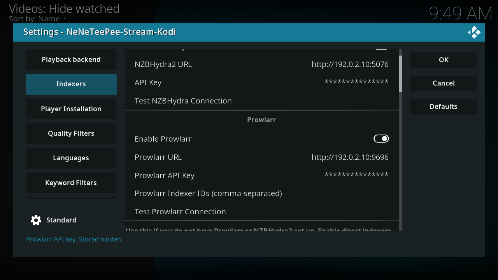
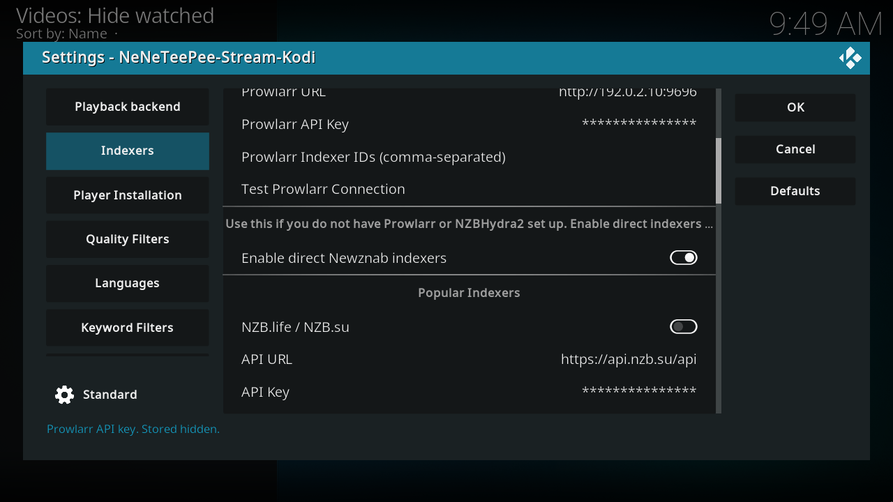
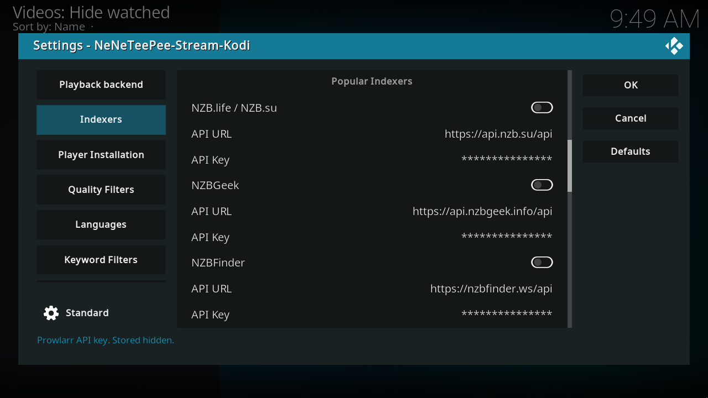
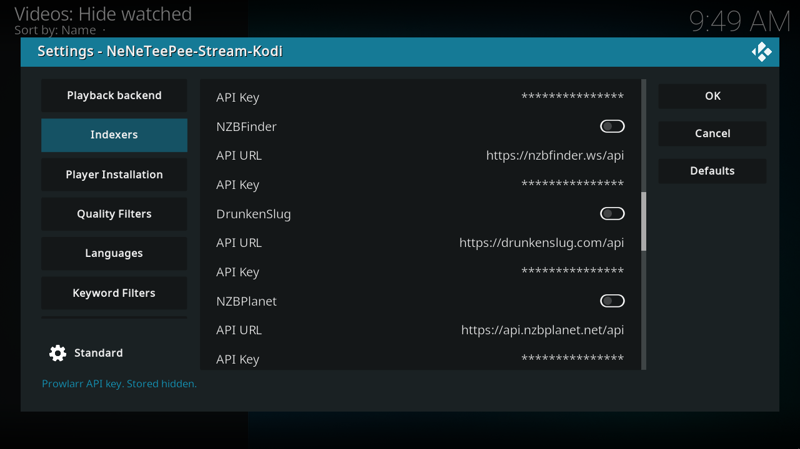
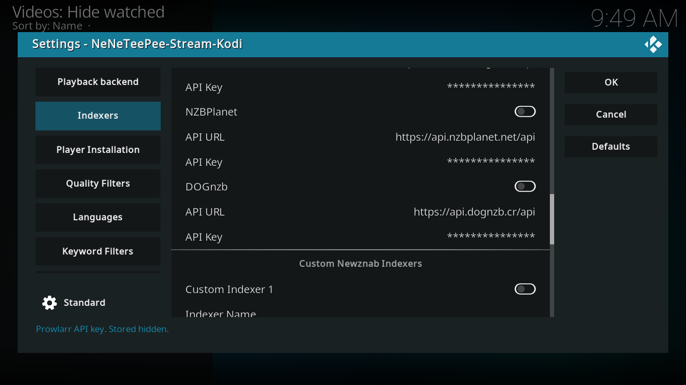
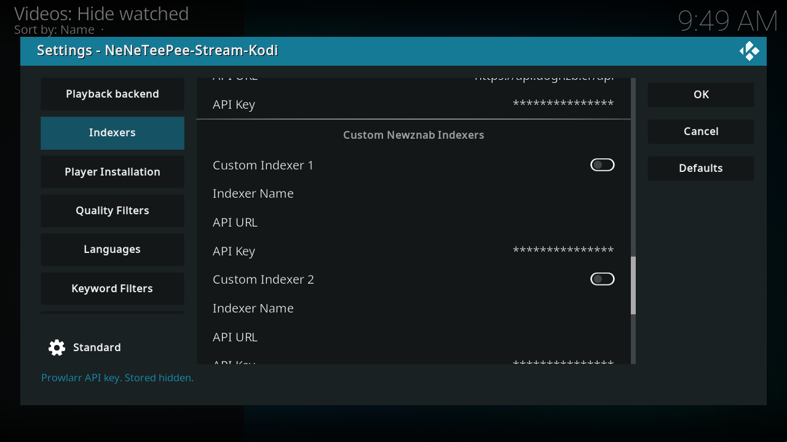
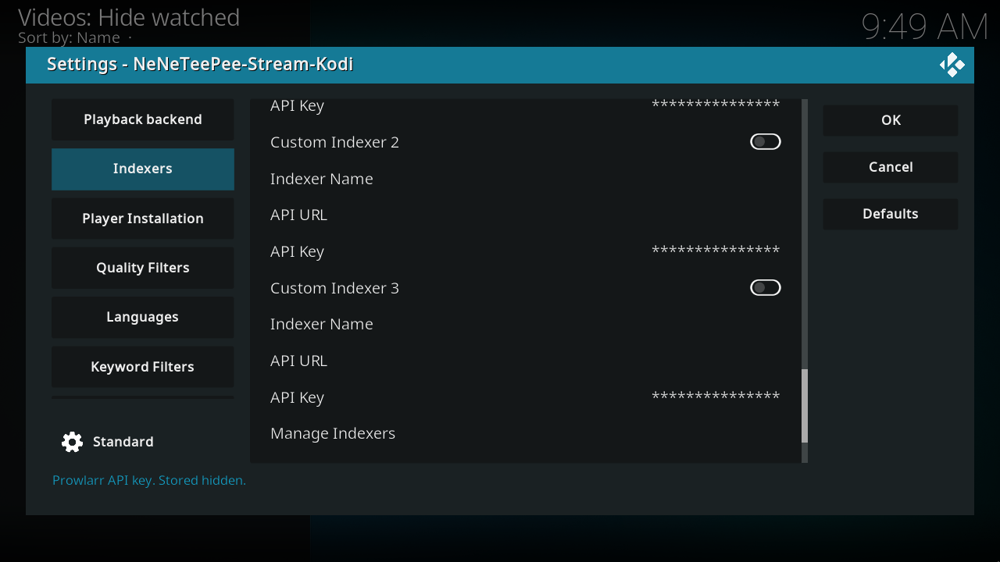

# Indexers

Enable at least one provider for nzbdav / InfiniDysk or NZBGet. You can combine NZBHydra2, Prowlarr, and direct Newznab providers. Local provider settings do not configure StreamNZB: add its indexers in the StreamNZB dashboard. Each direct provider has an independent enable switch, API endpoint, and key. The global direct-indexer switch must also be on. See [search and indexers](../features/search-and-indexers.md) and [TMDB API setup](../getting-started/tmdb-api.md).

## Kodi screenshots

Captured on the OrbStack Kodi VM from commit `db07f61`. Debug overlays are off, and credentials use example values. [Capture details](index.md#capture-details).

## Every option

### NZBHydra2

| Option and setting ID | Default | What it does |
| --- | --- | --- |
| Enable NZBHydra2[^source-nzbhydra_enabled] `nzbhydra_enabled` | Off | Use NZBHydra2 for TMDBHelper playback searches alongside or instead of Prowlarr and direct indexers. The add-on search menu and plugin play URLs still query Hydra when this switch is off. |
| NZBHydra2 URL[^source-hydra_url] `hydra_url` | http://localhost:5076 | Base URL of your NZBHydra2 instance. |
| API Key[^source-hydra_api_key] `hydra_api_key` | Empty | NZBHydra2 API key. The dialog masks the value; the profile settings file stores it. |
| Test NZBHydra Connection[^source-action_test_hydra] `action_test_hydra` | Button | Verify the NZBHydra2 URL and API key are reachable and valid. |

### Prowlarr

| Option and setting ID | Default | What it does |
| --- | --- | --- |
| Enable Prowlarr[^source-prowlarr_enabled] `prowlarr_enabled` | Off | Use Prowlarr as a search provider. Only Usenet results are kept. |
| Prowlarr URL[^source-prowlarr_host] `prowlarr_host` | http://localhost:9696 | Base URL of your Prowlarr instance. |
| Prowlarr API Key[^source-prowlarr_api_key] `prowlarr_api_key` | Empty | Prowlarr API key. The dialog masks the value; the profile settings file stores it. |
| Prowlarr Indexer IDs (comma-separated)[^source-prowlarr_indexer_ids] `prowlarr_indexer_ids` | Empty | Prowlarr indexer IDs to query, comma-separated. Required for Prowlarr search; leaving this blank returns no results. |
| Test Prowlarr Connection[^source-action_test_prowlarr] `action_test_prowlarr` | Button | Verify the Prowlarr URL, API key, and indexer IDs are reachable. |

### Direct Newznab indexers

| Option and setting ID | Default | What it does |
| --- | --- | --- |
| Enable direct Newznab indexers[^source-direct_indexers_enabled] `direct_indexers_enabled` | Off | Master switch for direct Newznab indexers. Use this if you don't run Prowlarr or NZBHydra2. |

### Popular Indexers

| Option and setting ID | Default | What it does |
| --- | --- | --- |
| NZB.life / NZB.su[^source-direct_indexer_nzblife_enabled] `direct_indexer_nzblife_enabled` | Off | Search NZB.life / NZB.su directly. Available when direct_indexers_enabled = true. |
| API URL[^source-direct_indexer_nzblife_url] `direct_indexer_nzblife_url` | https://api.nzb.su/api | NZB.life / NZB.su API URL. Available when direct_indexers_enabled = true. |
| API Key[^source-direct_indexer_nzblife_api_key] `direct_indexer_nzblife_api_key` | Empty | NZB.life / NZB.su API key. The dialog masks the value; the profile settings file stores it. Available when direct_indexers_enabled = true. |
| NZBGeek[^source-direct_indexer_nzbgeek_enabled] `direct_indexer_nzbgeek_enabled` | Off | Search NZBGeek directly. Available when direct_indexers_enabled = true. |
| API URL[^source-direct_indexer_nzbgeek_url] `direct_indexer_nzbgeek_url` | https://api.nzbgeek.info/api | NZBGeek API URL. Available when direct_indexers_enabled = true. |
| API Key[^source-direct_indexer_nzbgeek_api_key] `direct_indexer_nzbgeek_api_key` | Empty | NZBGeek API key. The dialog masks the value; the profile settings file stores it. Available when direct_indexers_enabled = true. |
| NZBFinder[^source-direct_indexer_nzbfinder_enabled] `direct_indexer_nzbfinder_enabled` | Off | Search NZBFinder directly. Available when direct_indexers_enabled = true. |
| API URL[^source-direct_indexer_nzbfinder_url] `direct_indexer_nzbfinder_url` | https://nzbfinder.ws/api | NZBFinder API URL. Available when direct_indexers_enabled = true. |
| API Key[^source-direct_indexer_nzbfinder_api_key] `direct_indexer_nzbfinder_api_key` | Empty | NZBFinder API key. The dialog masks the value; the profile settings file stores it. Available when direct_indexers_enabled = true. |
| DrunkenSlug[^source-direct_indexer_drunkenslug_enabled] `direct_indexer_drunkenslug_enabled` | Off | Search DrunkenSlug directly. Available when direct_indexers_enabled = true. |
| API URL[^source-direct_indexer_drunkenslug_url] `direct_indexer_drunkenslug_url` | https://drunkenslug.com/api | DrunkenSlug API URL. Available when direct_indexers_enabled = true. |
| API Key[^source-direct_indexer_drunkenslug_api_key] `direct_indexer_drunkenslug_api_key` | Empty | DrunkenSlug API key. The dialog masks the value; the profile settings file stores it. Available when direct_indexers_enabled = true. |
| NZBPlanet[^source-direct_indexer_nzbplanet_enabled] `direct_indexer_nzbplanet_enabled` | Off | Search NZBPlanet directly. Available when direct_indexers_enabled = true. |
| API URL[^source-direct_indexer_nzbplanet_url] `direct_indexer_nzbplanet_url` | https://api.nzbplanet.net/api | NZBPlanet API URL. Available when direct_indexers_enabled = true. |
| API Key[^source-direct_indexer_nzbplanet_api_key] `direct_indexer_nzbplanet_api_key` | Empty | NZBPlanet API key. The dialog masks the value; the profile settings file stores it. Available when direct_indexers_enabled = true. |
| DOGnzb[^source-direct_indexer_dognzb_enabled] `direct_indexer_dognzb_enabled` | Off | Search DOGnzb directly. Available when direct_indexers_enabled = true. |
| API URL[^source-direct_indexer_dognzb_url] `direct_indexer_dognzb_url` | https://api.dognzb.cr/api | DOGnzb API URL. Available when direct_indexers_enabled = true. |
| API Key[^source-direct_indexer_dognzb_api_key] `direct_indexer_dognzb_api_key` | Empty | DOGnzb API key. The dialog masks the value; the profile settings file stores it. Available when direct_indexers_enabled = true. |

### Custom Newznab Indexers

| Option and setting ID | Default | What it does |
| --- | --- | --- |
| Custom Indexer 1[^source-direct_indexer_custom1_enabled] `direct_indexer_custom1_enabled` | Off | Search Custom Indexer 1 directly. Use this for any Newznab indexer not in the preset list. Available when direct_indexers_enabled = true. |
| Indexer Name[^source-direct_indexer_custom1_name] `direct_indexer_custom1_name` | Empty | Display name for Custom Indexer 1. Available when direct_indexers_enabled = true. |
| API URL[^source-direct_indexer_custom1_url] `direct_indexer_custom1_url` | Empty | Custom Indexer 1 API URL. Available when direct_indexers_enabled = true. |
| API Key[^source-direct_indexer_custom1_api_key] `direct_indexer_custom1_api_key` | Empty | Custom Indexer 1 API key. The dialog masks the value; the profile settings file stores it. Available when direct_indexers_enabled = true. |
| Custom Indexer 2[^source-direct_indexer_custom2_enabled] `direct_indexer_custom2_enabled` | Off | Search Custom Indexer 2 directly. Use this for any Newznab indexer not in the preset list. Available when direct_indexers_enabled = true. |
| Indexer Name[^source-direct_indexer_custom2_name] `direct_indexer_custom2_name` | Empty | Display name for Custom Indexer 2. Available when direct_indexers_enabled = true. |
| API URL[^source-direct_indexer_custom2_url] `direct_indexer_custom2_url` | Empty | Custom Indexer 2 API URL. Available when direct_indexers_enabled = true. |
| API Key[^source-direct_indexer_custom2_api_key] `direct_indexer_custom2_api_key` | Empty | Custom Indexer 2 API key. The dialog masks the value; the profile settings file stores it. Available when direct_indexers_enabled = true. |
| Custom Indexer 3[^source-direct_indexer_custom3_enabled] `direct_indexer_custom3_enabled` | Off | Search Custom Indexer 3 directly. Use this for any Newznab indexer not in the preset list. Available when direct_indexers_enabled = true. |
| Indexer Name[^source-direct_indexer_custom3_name] `direct_indexer_custom3_name` | Empty | Display name for Custom Indexer 3. Available when direct_indexers_enabled = true. |
| API URL[^source-direct_indexer_custom3_url] `direct_indexer_custom3_url` | Empty | Custom Indexer 3 API URL. Available when direct_indexers_enabled = true. |
| API Key[^source-direct_indexer_custom3_api_key] `direct_indexer_custom3_api_key` | Empty | Custom Indexer 3 API key. The dialog masks the value; the profile settings file stores it. Available when direct_indexers_enabled = true. |
| Manage Indexers[^source-action_manage_indexers] `action_manage_indexers` | Button | Add an indexer from a preset catalog or a custom URL; test, edit, turn on, turn off, or delete existing ones. Available when direct_indexers_enabled = true. |
| Test Direct Indexers[^source-action_test_direct_indexers] `action_test_direct_indexers` | Button | Verify every enabled direct indexer is reachable. Available when direct_indexers_enabled = true. |

### TV search accuracy

| Option and setting ID | Default | What it does |
| --- | --- | --- |
| TMDB API key (optional, movies and TV)[^source-tmdb_api_key] `tmdb_api_key` | Empty | Optional TMDB API v3 key for converting TMDB movie IDs to IMDb IDs and TV series IDs to TVDB IDs when those identifiers are missing. Use the TMDB API key. A TVDB key or API Read Access Token does not work in this field. If lookup fails or no key is set, searches use supplied IDs or title text. |

## Source notes

Labels and schema defaults are from commit [`db07f61`](https://github.com/Appz4Fun/NeNeTeePee-Stream-Kodi/blob/db07f61d4090a0c89ec8461ee9b3ca34f9607aa6/repo/plugin.video.nzbdav/resources/settings.xml). Runtime limits can differ from the editable schema; the explanations identify those limits. Links use the full commit ID, so later changes to `main` do not move them.

[^source-nzbhydra_enabled]: [Setting declaration](https://github.com/Appz4Fun/NeNeTeePee-Stream-Kodi/blob/db07f61d4090a0c89ec8461ee9b3ca34f9607aa6/repo/plugin.video.nzbdav/resources/settings.xml#L208); [runtime reference](https://github.com/Appz4Fun/NeNeTeePee-Stream-Kodi/blob/db07f61d4090a0c89ec8461ee9b3ca34f9607aa6/repo/plugin.video.nzbdav/resources/lib/router.py#L472).
[^source-hydra_url]: [Setting declaration](https://github.com/Appz4Fun/NeNeTeePee-Stream-Kodi/blob/db07f61d4090a0c89ec8461ee9b3ca34f9607aa6/repo/plugin.video.nzbdav/resources/settings.xml#L213); [runtime reference](https://github.com/Appz4Fun/NeNeTeePee-Stream-Kodi/blob/db07f61d4090a0c89ec8461ee9b3ca34f9607aa6/repo/plugin.video.nzbdav/resources/lib/hydra.py#L81).
[^source-hydra_api_key]: [Setting declaration](https://github.com/Appz4Fun/NeNeTeePee-Stream-Kodi/blob/db07f61d4090a0c89ec8461ee9b3ca34f9607aa6/repo/plugin.video.nzbdav/resources/settings.xml#L223); [runtime reference](https://github.com/Appz4Fun/NeNeTeePee-Stream-Kodi/blob/db07f61d4090a0c89ec8461ee9b3ca34f9607aa6/repo/plugin.video.nzbdav/resources/lib/hydra.py#L82).
[^source-action_test_hydra]: [Setting declaration](https://github.com/Appz4Fun/NeNeTeePee-Stream-Kodi/blob/db07f61d4090a0c89ec8461ee9b3ca34f9607aa6/repo/plugin.video.nzbdav/resources/settings.xml#L234).
[^source-prowlarr_enabled]: [Setting declaration](https://github.com/Appz4Fun/NeNeTeePee-Stream-Kodi/blob/db07f61d4090a0c89ec8461ee9b3ca34f9607aa6/repo/plugin.video.nzbdav/resources/settings.xml#L243); [runtime reference](https://github.com/Appz4Fun/NeNeTeePee-Stream-Kodi/blob/db07f61d4090a0c89ec8461ee9b3ca34f9607aa6/repo/plugin.video.nzbdav/resources/lib/router.py#L473).
[^source-prowlarr_host]: [Setting declaration](https://github.com/Appz4Fun/NeNeTeePee-Stream-Kodi/blob/db07f61d4090a0c89ec8461ee9b3ca34f9607aa6/repo/plugin.video.nzbdav/resources/settings.xml#L248); [runtime reference](https://github.com/Appz4Fun/NeNeTeePee-Stream-Kodi/blob/db07f61d4090a0c89ec8461ee9b3ca34f9607aa6/repo/plugin.video.nzbdav/resources/lib/prowlarr.py#L87).
[^source-prowlarr_api_key]: [Setting declaration](https://github.com/Appz4Fun/NeNeTeePee-Stream-Kodi/blob/db07f61d4090a0c89ec8461ee9b3ca34f9607aa6/repo/plugin.video.nzbdav/resources/settings.xml#L258); [runtime reference](https://github.com/Appz4Fun/NeNeTeePee-Stream-Kodi/blob/db07f61d4090a0c89ec8461ee9b3ca34f9607aa6/repo/plugin.video.nzbdav/resources/lib/prowlarr.py#L88).
[^source-prowlarr_indexer_ids]: [Setting declaration](https://github.com/Appz4Fun/NeNeTeePee-Stream-Kodi/blob/db07f61d4090a0c89ec8461ee9b3ca34f9607aa6/repo/plugin.video.nzbdav/resources/settings.xml#L269); [runtime reference](https://github.com/Appz4Fun/NeNeTeePee-Stream-Kodi/blob/db07f61d4090a0c89ec8461ee9b3ca34f9607aa6/repo/plugin.video.nzbdav/resources/lib/prowlarr.py#L89).
[^source-action_test_prowlarr]: [Setting declaration](https://github.com/Appz4Fun/NeNeTeePee-Stream-Kodi/blob/db07f61d4090a0c89ec8461ee9b3ca34f9607aa6/repo/plugin.video.nzbdav/resources/settings.xml#L279).
[^source-direct_indexers_enabled]: [Setting declaration](https://github.com/Appz4Fun/NeNeTeePee-Stream-Kodi/blob/db07f61d4090a0c89ec8461ee9b3ca34f9607aa6/repo/plugin.video.nzbdav/resources/settings.xml#L288); [runtime reference](https://github.com/Appz4Fun/NeNeTeePee-Stream-Kodi/blob/db07f61d4090a0c89ec8461ee9b3ca34f9607aa6/repo/plugin.video.nzbdav/resources/lib/direct_indexers.py#L164).
[^source-direct_indexer_nzblife_enabled]: [Setting declaration](https://github.com/Appz4Fun/NeNeTeePee-Stream-Kodi/blob/db07f61d4090a0c89ec8461ee9b3ca34f9607aa6/repo/plugin.video.nzbdav/resources/settings.xml#L295); [runtime reference](https://github.com/Appz4Fun/NeNeTeePee-Stream-Kodi/blob/db07f61d4090a0c89ec8461ee9b3ca34f9607aa6/repo/plugin.video.nzbdav/resources/lib/direct_indexers.py#L73).
[^source-direct_indexer_nzblife_url]: [Setting declaration](https://github.com/Appz4Fun/NeNeTeePee-Stream-Kodi/blob/db07f61d4090a0c89ec8461ee9b3ca34f9607aa6/repo/plugin.video.nzbdav/resources/settings.xml#L303); [runtime reference](https://github.com/Appz4Fun/NeNeTeePee-Stream-Kodi/blob/db07f61d4090a0c89ec8461ee9b3ca34f9607aa6/repo/plugin.video.nzbdav/resources/lib/direct_indexers.py#L73).
[^source-direct_indexer_nzblife_api_key]: [Setting declaration](https://github.com/Appz4Fun/NeNeTeePee-Stream-Kodi/blob/db07f61d4090a0c89ec8461ee9b3ca34f9607aa6/repo/plugin.video.nzbdav/resources/settings.xml#L316); [runtime reference](https://github.com/Appz4Fun/NeNeTeePee-Stream-Kodi/blob/db07f61d4090a0c89ec8461ee9b3ca34f9607aa6/repo/plugin.video.nzbdav/resources/lib/direct_indexers.py#L73).
[^source-direct_indexer_nzbgeek_enabled]: [Setting declaration](https://github.com/Appz4Fun/NeNeTeePee-Stream-Kodi/blob/db07f61d4090a0c89ec8461ee9b3ca34f9607aa6/repo/plugin.video.nzbdav/resources/settings.xml#L330); [runtime reference](https://github.com/Appz4Fun/NeNeTeePee-Stream-Kodi/blob/db07f61d4090a0c89ec8461ee9b3ca34f9607aa6/repo/plugin.video.nzbdav/resources/lib/direct_indexers.py#L73).
[^source-direct_indexer_nzbgeek_url]: [Setting declaration](https://github.com/Appz4Fun/NeNeTeePee-Stream-Kodi/blob/db07f61d4090a0c89ec8461ee9b3ca34f9607aa6/repo/plugin.video.nzbdav/resources/settings.xml#L338); [runtime reference](https://github.com/Appz4Fun/NeNeTeePee-Stream-Kodi/blob/db07f61d4090a0c89ec8461ee9b3ca34f9607aa6/repo/plugin.video.nzbdav/resources/lib/direct_indexers.py#L73).
[^source-direct_indexer_nzbgeek_api_key]: [Setting declaration](https://github.com/Appz4Fun/NeNeTeePee-Stream-Kodi/blob/db07f61d4090a0c89ec8461ee9b3ca34f9607aa6/repo/plugin.video.nzbdav/resources/settings.xml#L351); [runtime reference](https://github.com/Appz4Fun/NeNeTeePee-Stream-Kodi/blob/db07f61d4090a0c89ec8461ee9b3ca34f9607aa6/repo/plugin.video.nzbdav/resources/lib/direct_indexers.py#L73).
[^source-direct_indexer_nzbfinder_enabled]: [Setting declaration](https://github.com/Appz4Fun/NeNeTeePee-Stream-Kodi/blob/db07f61d4090a0c89ec8461ee9b3ca34f9607aa6/repo/plugin.video.nzbdav/resources/settings.xml#L365); [runtime reference](https://github.com/Appz4Fun/NeNeTeePee-Stream-Kodi/blob/db07f61d4090a0c89ec8461ee9b3ca34f9607aa6/repo/plugin.video.nzbdav/resources/lib/direct_indexers.py#L73).
[^source-direct_indexer_nzbfinder_url]: [Setting declaration](https://github.com/Appz4Fun/NeNeTeePee-Stream-Kodi/blob/db07f61d4090a0c89ec8461ee9b3ca34f9607aa6/repo/plugin.video.nzbdav/resources/settings.xml#L373); [runtime reference](https://github.com/Appz4Fun/NeNeTeePee-Stream-Kodi/blob/db07f61d4090a0c89ec8461ee9b3ca34f9607aa6/repo/plugin.video.nzbdav/resources/lib/direct_indexers.py#L73).
[^source-direct_indexer_nzbfinder_api_key]: [Setting declaration](https://github.com/Appz4Fun/NeNeTeePee-Stream-Kodi/blob/db07f61d4090a0c89ec8461ee9b3ca34f9607aa6/repo/plugin.video.nzbdav/resources/settings.xml#L386); [runtime reference](https://github.com/Appz4Fun/NeNeTeePee-Stream-Kodi/blob/db07f61d4090a0c89ec8461ee9b3ca34f9607aa6/repo/plugin.video.nzbdav/resources/lib/direct_indexers.py#L73).
[^source-direct_indexer_drunkenslug_enabled]: [Setting declaration](https://github.com/Appz4Fun/NeNeTeePee-Stream-Kodi/blob/db07f61d4090a0c89ec8461ee9b3ca34f9607aa6/repo/plugin.video.nzbdav/resources/settings.xml#L400); [runtime reference](https://github.com/Appz4Fun/NeNeTeePee-Stream-Kodi/blob/db07f61d4090a0c89ec8461ee9b3ca34f9607aa6/repo/plugin.video.nzbdav/resources/lib/direct_indexers.py#L73).
[^source-direct_indexer_drunkenslug_url]: [Setting declaration](https://github.com/Appz4Fun/NeNeTeePee-Stream-Kodi/blob/db07f61d4090a0c89ec8461ee9b3ca34f9607aa6/repo/plugin.video.nzbdav/resources/settings.xml#L408); [runtime reference](https://github.com/Appz4Fun/NeNeTeePee-Stream-Kodi/blob/db07f61d4090a0c89ec8461ee9b3ca34f9607aa6/repo/plugin.video.nzbdav/resources/lib/direct_indexers.py#L73).
[^source-direct_indexer_drunkenslug_api_key]: [Setting declaration](https://github.com/Appz4Fun/NeNeTeePee-Stream-Kodi/blob/db07f61d4090a0c89ec8461ee9b3ca34f9607aa6/repo/plugin.video.nzbdav/resources/settings.xml#L421); [runtime reference](https://github.com/Appz4Fun/NeNeTeePee-Stream-Kodi/blob/db07f61d4090a0c89ec8461ee9b3ca34f9607aa6/repo/plugin.video.nzbdav/resources/lib/direct_indexers.py#L73).
[^source-direct_indexer_nzbplanet_enabled]: [Setting declaration](https://github.com/Appz4Fun/NeNeTeePee-Stream-Kodi/blob/db07f61d4090a0c89ec8461ee9b3ca34f9607aa6/repo/plugin.video.nzbdav/resources/settings.xml#L435); [runtime reference](https://github.com/Appz4Fun/NeNeTeePee-Stream-Kodi/blob/db07f61d4090a0c89ec8461ee9b3ca34f9607aa6/repo/plugin.video.nzbdav/resources/lib/direct_indexers.py#L73).
[^source-direct_indexer_nzbplanet_url]: [Setting declaration](https://github.com/Appz4Fun/NeNeTeePee-Stream-Kodi/blob/db07f61d4090a0c89ec8461ee9b3ca34f9607aa6/repo/plugin.video.nzbdav/resources/settings.xml#L443); [runtime reference](https://github.com/Appz4Fun/NeNeTeePee-Stream-Kodi/blob/db07f61d4090a0c89ec8461ee9b3ca34f9607aa6/repo/plugin.video.nzbdav/resources/lib/direct_indexers.py#L73).
[^source-direct_indexer_nzbplanet_api_key]: [Setting declaration](https://github.com/Appz4Fun/NeNeTeePee-Stream-Kodi/blob/db07f61d4090a0c89ec8461ee9b3ca34f9607aa6/repo/plugin.video.nzbdav/resources/settings.xml#L456); [runtime reference](https://github.com/Appz4Fun/NeNeTeePee-Stream-Kodi/blob/db07f61d4090a0c89ec8461ee9b3ca34f9607aa6/repo/plugin.video.nzbdav/resources/lib/direct_indexers.py#L73).
[^source-direct_indexer_dognzb_enabled]: [Setting declaration](https://github.com/Appz4Fun/NeNeTeePee-Stream-Kodi/blob/db07f61d4090a0c89ec8461ee9b3ca34f9607aa6/repo/plugin.video.nzbdav/resources/settings.xml#L470); [runtime reference](https://github.com/Appz4Fun/NeNeTeePee-Stream-Kodi/blob/db07f61d4090a0c89ec8461ee9b3ca34f9607aa6/repo/plugin.video.nzbdav/resources/lib/direct_indexers.py#L73).
[^source-direct_indexer_dognzb_url]: [Setting declaration](https://github.com/Appz4Fun/NeNeTeePee-Stream-Kodi/blob/db07f61d4090a0c89ec8461ee9b3ca34f9607aa6/repo/plugin.video.nzbdav/resources/settings.xml#L478); [runtime reference](https://github.com/Appz4Fun/NeNeTeePee-Stream-Kodi/blob/db07f61d4090a0c89ec8461ee9b3ca34f9607aa6/repo/plugin.video.nzbdav/resources/lib/direct_indexers.py#L73).
[^source-direct_indexer_dognzb_api_key]: [Setting declaration](https://github.com/Appz4Fun/NeNeTeePee-Stream-Kodi/blob/db07f61d4090a0c89ec8461ee9b3ca34f9607aa6/repo/plugin.video.nzbdav/resources/settings.xml#L491); [runtime reference](https://github.com/Appz4Fun/NeNeTeePee-Stream-Kodi/blob/db07f61d4090a0c89ec8461ee9b3ca34f9607aa6/repo/plugin.video.nzbdav/resources/lib/direct_indexers.py#L73).
[^source-direct_indexer_custom1_enabled]: [Setting declaration](https://github.com/Appz4Fun/NeNeTeePee-Stream-Kodi/blob/db07f61d4090a0c89ec8461ee9b3ca34f9607aa6/repo/plugin.video.nzbdav/resources/settings.xml#L507); [runtime reference](https://github.com/Appz4Fun/NeNeTeePee-Stream-Kodi/blob/db07f61d4090a0c89ec8461ee9b3ca34f9607aa6/repo/plugin.video.nzbdav/resources/lib/direct_indexers.py#L98).
[^source-direct_indexer_custom1_name]: [Setting declaration](https://github.com/Appz4Fun/NeNeTeePee-Stream-Kodi/blob/db07f61d4090a0c89ec8461ee9b3ca34f9607aa6/repo/plugin.video.nzbdav/resources/settings.xml#L515); [runtime reference](https://github.com/Appz4Fun/NeNeTeePee-Stream-Kodi/blob/db07f61d4090a0c89ec8461ee9b3ca34f9607aa6/repo/plugin.video.nzbdav/resources/lib/direct_indexers.py#L98).
[^source-direct_indexer_custom1_url]: [Setting declaration](https://github.com/Appz4Fun/NeNeTeePee-Stream-Kodi/blob/db07f61d4090a0c89ec8461ee9b3ca34f9607aa6/repo/plugin.video.nzbdav/resources/settings.xml#L528); [runtime reference](https://github.com/Appz4Fun/NeNeTeePee-Stream-Kodi/blob/db07f61d4090a0c89ec8461ee9b3ca34f9607aa6/repo/plugin.video.nzbdav/resources/lib/direct_indexers.py#L98).
[^source-direct_indexer_custom1_api_key]: [Setting declaration](https://github.com/Appz4Fun/NeNeTeePee-Stream-Kodi/blob/db07f61d4090a0c89ec8461ee9b3ca34f9607aa6/repo/plugin.video.nzbdav/resources/settings.xml#L541); [runtime reference](https://github.com/Appz4Fun/NeNeTeePee-Stream-Kodi/blob/db07f61d4090a0c89ec8461ee9b3ca34f9607aa6/repo/plugin.video.nzbdav/resources/lib/direct_indexers.py#L98).
[^source-direct_indexer_custom2_enabled]: [Setting declaration](https://github.com/Appz4Fun/NeNeTeePee-Stream-Kodi/blob/db07f61d4090a0c89ec8461ee9b3ca34f9607aa6/repo/plugin.video.nzbdav/resources/settings.xml#L555); [runtime reference](https://github.com/Appz4Fun/NeNeTeePee-Stream-Kodi/blob/db07f61d4090a0c89ec8461ee9b3ca34f9607aa6/repo/plugin.video.nzbdav/resources/lib/direct_indexers.py#L98).
[^source-direct_indexer_custom2_name]: [Setting declaration](https://github.com/Appz4Fun/NeNeTeePee-Stream-Kodi/blob/db07f61d4090a0c89ec8461ee9b3ca34f9607aa6/repo/plugin.video.nzbdav/resources/settings.xml#L563); [runtime reference](https://github.com/Appz4Fun/NeNeTeePee-Stream-Kodi/blob/db07f61d4090a0c89ec8461ee9b3ca34f9607aa6/repo/plugin.video.nzbdav/resources/lib/direct_indexers.py#L98).
[^source-direct_indexer_custom2_url]: [Setting declaration](https://github.com/Appz4Fun/NeNeTeePee-Stream-Kodi/blob/db07f61d4090a0c89ec8461ee9b3ca34f9607aa6/repo/plugin.video.nzbdav/resources/settings.xml#L576); [runtime reference](https://github.com/Appz4Fun/NeNeTeePee-Stream-Kodi/blob/db07f61d4090a0c89ec8461ee9b3ca34f9607aa6/repo/plugin.video.nzbdav/resources/lib/direct_indexers.py#L98).
[^source-direct_indexer_custom2_api_key]: [Setting declaration](https://github.com/Appz4Fun/NeNeTeePee-Stream-Kodi/blob/db07f61d4090a0c89ec8461ee9b3ca34f9607aa6/repo/plugin.video.nzbdav/resources/settings.xml#L589); [runtime reference](https://github.com/Appz4Fun/NeNeTeePee-Stream-Kodi/blob/db07f61d4090a0c89ec8461ee9b3ca34f9607aa6/repo/plugin.video.nzbdav/resources/lib/direct_indexers.py#L98).
[^source-direct_indexer_custom3_enabled]: [Setting declaration](https://github.com/Appz4Fun/NeNeTeePee-Stream-Kodi/blob/db07f61d4090a0c89ec8461ee9b3ca34f9607aa6/repo/plugin.video.nzbdav/resources/settings.xml#L603); [runtime reference](https://github.com/Appz4Fun/NeNeTeePee-Stream-Kodi/blob/db07f61d4090a0c89ec8461ee9b3ca34f9607aa6/repo/plugin.video.nzbdav/resources/lib/direct_indexers.py#L98).
[^source-direct_indexer_custom3_name]: [Setting declaration](https://github.com/Appz4Fun/NeNeTeePee-Stream-Kodi/blob/db07f61d4090a0c89ec8461ee9b3ca34f9607aa6/repo/plugin.video.nzbdav/resources/settings.xml#L611); [runtime reference](https://github.com/Appz4Fun/NeNeTeePee-Stream-Kodi/blob/db07f61d4090a0c89ec8461ee9b3ca34f9607aa6/repo/plugin.video.nzbdav/resources/lib/direct_indexers.py#L98).
[^source-direct_indexer_custom3_url]: [Setting declaration](https://github.com/Appz4Fun/NeNeTeePee-Stream-Kodi/blob/db07f61d4090a0c89ec8461ee9b3ca34f9607aa6/repo/plugin.video.nzbdav/resources/settings.xml#L624); [runtime reference](https://github.com/Appz4Fun/NeNeTeePee-Stream-Kodi/blob/db07f61d4090a0c89ec8461ee9b3ca34f9607aa6/repo/plugin.video.nzbdav/resources/lib/direct_indexers.py#L98).
[^source-direct_indexer_custom3_api_key]: [Setting declaration](https://github.com/Appz4Fun/NeNeTeePee-Stream-Kodi/blob/db07f61d4090a0c89ec8461ee9b3ca34f9607aa6/repo/plugin.video.nzbdav/resources/settings.xml#L637); [runtime reference](https://github.com/Appz4Fun/NeNeTeePee-Stream-Kodi/blob/db07f61d4090a0c89ec8461ee9b3ca34f9607aa6/repo/plugin.video.nzbdav/resources/lib/direct_indexers.py#L98).
[^source-action_manage_indexers]: [Setting declaration](https://github.com/Appz4Fun/NeNeTeePee-Stream-Kodi/blob/db07f61d4090a0c89ec8461ee9b3ca34f9607aa6/repo/plugin.video.nzbdav/resources/settings.xml#L651).
[^source-action_test_direct_indexers]: [Setting declaration](https://github.com/Appz4Fun/NeNeTeePee-Stream-Kodi/blob/db07f61d4090a0c89ec8461ee9b3ca34f9607aa6/repo/plugin.video.nzbdav/resources/settings.xml#L661).
[^source-tmdb_api_key]: [Setting declaration](https://github.com/Appz4Fun/NeNeTeePee-Stream-Kodi/blob/db07f61d4090a0c89ec8461ee9b3ca34f9607aa6/repo/plugin.video.nzbdav/resources/settings.xml#L673); [runtime reference](https://github.com/Appz4Fun/NeNeTeePee-Stream-Kodi/blob/db07f61d4090a0c89ec8461ee9b3ca34f9607aa6/repo/plugin.video.nzbdav/resources/lib/tvdb_resolver.py#L52).
