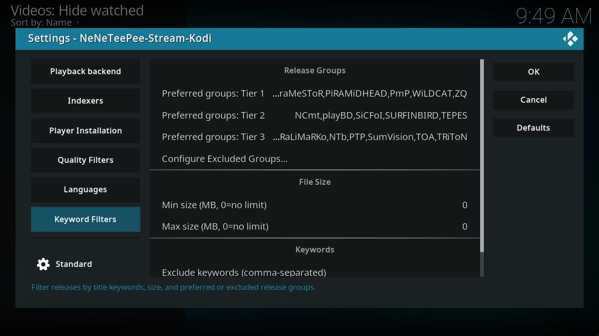
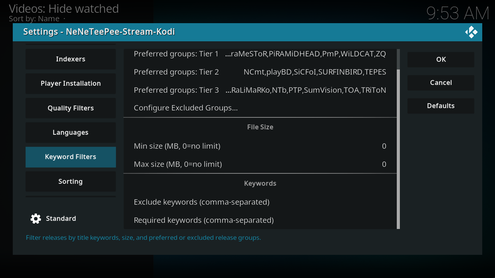

# Keyword filters

Preferred groups rank releases; excluded groups remove them. The three preferred tiers affect Relevance after resolution, HDR, and REMUX status, so a preferred group does not automatically outrank a higher-resolution release. Enter group names or keywords as comma-separated lists. Required keywords must all occur in the title. Any excluded keyword removes a matching title. Size limits use the reported release size, not the eventual video-file size. Set a size limit to 0 to remove that limit.

## Kodi screenshots

Captured on the OrbStack Kodi VM from commit `db07f61`. Debug overlays are off, and credentials use example values. [Capture details](index.md#capture-details).

## Every option

### Release groups

| Option and setting ID | Default | What it does |
| --- | --- | --- |
| filter_exclude_release_group[^source-filter_exclude_release_group] `filter_exclude_release_group` | Empty | Hidden comma-separated list edited by the excluded-groups configuration button. Matching groups are removed from the results. An empty list excludes no group. Hidden from the settings dialog. |
| Preferred groups: Tier 1[^source-filter_remux_tier_1] `filter_remux_tier_1` | 3L,ATELiER,BiZKiT,BLURANiUM,BMF,CiNEPHiLES,FraMeSToR,PiRAMiDHEAD,PmP,WiLDCAT,ZQ | Preferred release groups, priority 1 of 3. Enter comma-separated group names. Relevance ranks Tier 1 before Tier 2, then Tier 3, after resolution, HDR, and REMUX. Defaults use TRaSH Remux Tier 01. Empty leaves this tier unused. These preferences do not hide other groups. |
| Preferred groups: Tier 2[^source-filter_remux_tier_2] `filter_remux_tier_2` | NCmt,playBD,SiCFoI,SURFINBIRD,TEPES | Preferred release groups, priority 2 of 3. Enter comma-separated group names. Relevance ranks Tier 1 before Tier 2, then Tier 3, after resolution, HDR, and REMUX. Defaults use TRaSH Remux Tier 02. Empty leaves this tier unused. These preferences do not hide other groups. |
| Preferred groups: Tier 3[^source-filter_remux_tier_3] `filter_remux_tier_3` | 12GaugeShotgun,decibeL,EPSiLON,HiFi,iFT,KRaLiMaRKo,NTb,PTP,SumVision,TOA,TRiToN | Preferred release groups, priority 3 of 3. Enter comma-separated group names. Relevance ranks Tier 1 before Tier 2, then Tier 3, after resolution, HDR, and REMUX. Defaults use TRaSH Remux Tier 03. Empty leaves this tier unused. These preferences do not hide other groups. |
| Configure Excluded Groups...[^source-action_configure_excluded_groups] `action_configure_excluded_groups` | Button | Choose release groups to remove from results entirely. |

### File size

| Option and setting ID | Default | What it does |
| --- | --- | --- |
| Min size (MB, 0=no limit)[^source-filter_min_size] `filter_min_size` | 0 | Remove releases smaller than this size in MB. 0 = no limit. A release whose size can't be read is treated as 0 MB. |
| Max size (MB, 0=no limit)[^source-filter_max_size] `filter_max_size` | 0 | Remove releases larger than this size in MB. 0 = no limit. If set below Min size, the size filter is turned off. |

### Keywords

| Option and setting ID | Default | What it does |
| --- | --- | --- |
| Exclude keywords (comma-separated)[^source-filter_exclude_keywords] `filter_exclude_keywords` | Empty | Remove releases whose title contains any of these comma-separated keywords. |
| Required keywords (comma-separated)[^source-filter_require_keywords] `filter_require_keywords` | Empty | Remove releases unless their title contains every one of these comma-separated keywords. |

## Source notes

Labels and schema defaults are from commit [`db07f61`](https://github.com/Appz4Fun/NeNeTeePee-Stream-Kodi/blob/db07f61d4090a0c89ec8461ee9b3ca34f9607aa6/repo/plugin.video.nzbdav/resources/settings.xml). Runtime limits can differ from the editable schema; the explanations identify those limits. Links use the full commit ID, so later changes to `main` do not move them.

[^source-filter_exclude_release_group]: [Setting declaration](https://github.com/Appz4Fun/NeNeTeePee-Stream-Kodi/blob/db07f61d4090a0c89ec8461ee9b3ca34f9607aa6/repo/plugin.video.nzbdav/resources/settings.xml#L1220); [runtime reference](https://github.com/Appz4Fun/NeNeTeePee-Stream-Kodi/blob/db07f61d4090a0c89ec8461ee9b3ca34f9607aa6/repo/plugin.video.nzbdav/resources/lib/filter.py#L224).
[^source-filter_remux_tier_1]: [Setting declaration](https://github.com/Appz4Fun/NeNeTeePee-Stream-Kodi/blob/db07f61d4090a0c89ec8461ee9b3ca34f9607aa6/repo/plugin.video.nzbdav/resources/settings.xml#L1229); [runtime reference](https://github.com/Appz4Fun/NeNeTeePee-Stream-Kodi/blob/db07f61d4090a0c89ec8461ee9b3ca34f9607aa6/repo/plugin.video.nzbdav/resources/lib/router.py#L396).
[^source-filter_remux_tier_2]: [Setting declaration](https://github.com/Appz4Fun/NeNeTeePee-Stream-Kodi/blob/db07f61d4090a0c89ec8461ee9b3ca34f9607aa6/repo/plugin.video.nzbdav/resources/settings.xml#L1239); [runtime reference](https://github.com/Appz4Fun/NeNeTeePee-Stream-Kodi/blob/db07f61d4090a0c89ec8461ee9b3ca34f9607aa6/repo/plugin.video.nzbdav/resources/lib/router.py#L397).
[^source-filter_remux_tier_3]: [Setting declaration](https://github.com/Appz4Fun/NeNeTeePee-Stream-Kodi/blob/db07f61d4090a0c89ec8461ee9b3ca34f9607aa6/repo/plugin.video.nzbdav/resources/settings.xml#L1249); [runtime reference](https://github.com/Appz4Fun/NeNeTeePee-Stream-Kodi/blob/db07f61d4090a0c89ec8461ee9b3ca34f9607aa6/repo/plugin.video.nzbdav/resources/lib/router.py#L398).
[^source-action_configure_excluded_groups]: [Setting declaration](https://github.com/Appz4Fun/NeNeTeePee-Stream-Kodi/blob/db07f61d4090a0c89ec8461ee9b3ca34f9607aa6/repo/plugin.video.nzbdav/resources/settings.xml#L1259).
[^source-filter_min_size]: [Setting declaration](https://github.com/Appz4Fun/NeNeTeePee-Stream-Kodi/blob/db07f61d4090a0c89ec8461ee9b3ca34f9607aa6/repo/plugin.video.nzbdav/resources/settings.xml#L1268); [runtime reference](https://github.com/Appz4Fun/NeNeTeePee-Stream-Kodi/blob/db07f61d4090a0c89ec8461ee9b3ca34f9607aa6/repo/plugin.video.nzbdav/resources/lib/filter.py#L172).
[^source-filter_max_size]: [Setting declaration](https://github.com/Appz4Fun/NeNeTeePee-Stream-Kodi/blob/db07f61d4090a0c89ec8461ee9b3ca34f9607aa6/repo/plugin.video.nzbdav/resources/settings.xml#L1275); [runtime reference](https://github.com/Appz4Fun/NeNeTeePee-Stream-Kodi/blob/db07f61d4090a0c89ec8461ee9b3ca34f9607aa6/repo/plugin.video.nzbdav/resources/lib/filter.py#L173).
[^source-filter_exclude_keywords]: [Setting declaration](https://github.com/Appz4Fun/NeNeTeePee-Stream-Kodi/blob/db07f61d4090a0c89ec8461ee9b3ca34f9607aa6/repo/plugin.video.nzbdav/resources/settings.xml#L1284); [runtime reference](https://github.com/Appz4Fun/NeNeTeePee-Stream-Kodi/blob/db07f61d4090a0c89ec8461ee9b3ca34f9607aa6/repo/plugin.video.nzbdav/resources/lib/filter.py#L218).
[^source-filter_require_keywords]: [Setting declaration](https://github.com/Appz4Fun/NeNeTeePee-Stream-Kodi/blob/db07f61d4090a0c89ec8461ee9b3ca34f9607aa6/repo/plugin.video.nzbdav/resources/settings.xml#L1294); [runtime reference](https://github.com/Appz4Fun/NeNeTeePee-Stream-Kodi/blob/db07f61d4090a0c89ec8461ee9b3ca34f9607aa6/repo/plugin.video.nzbdav/resources/lib/filter.py#L221).
