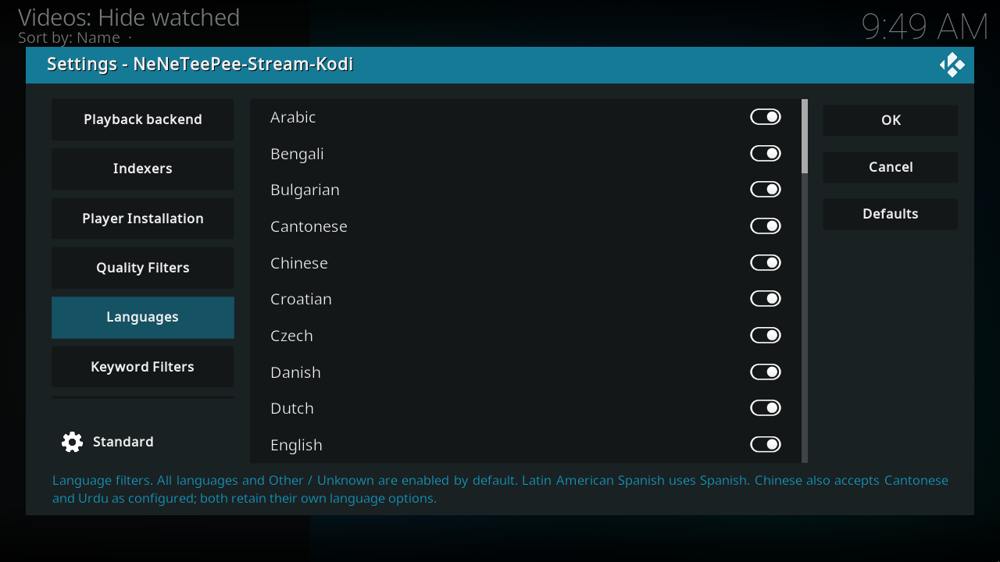
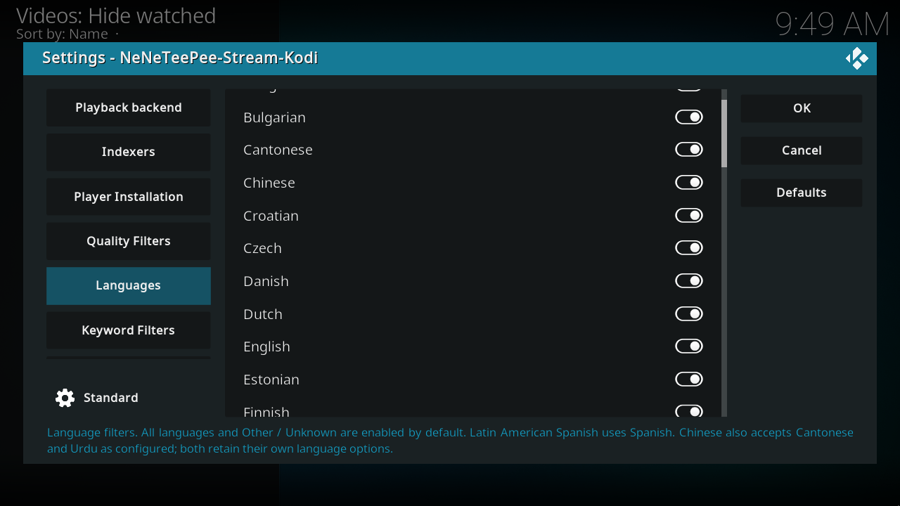
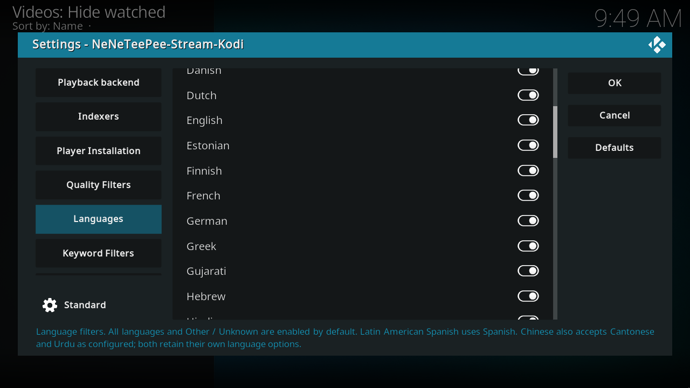
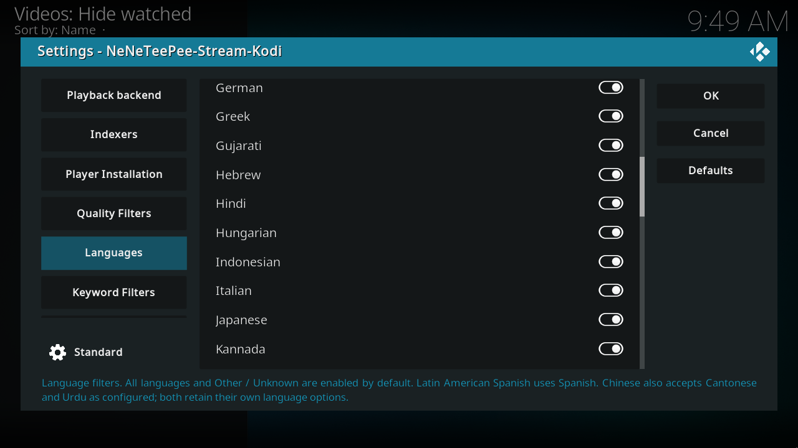
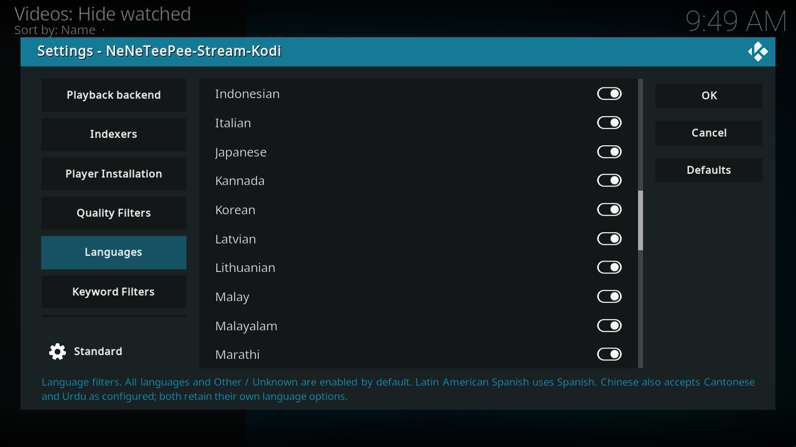
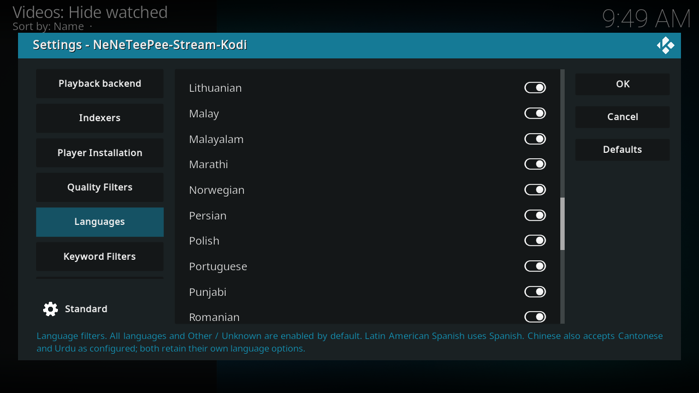
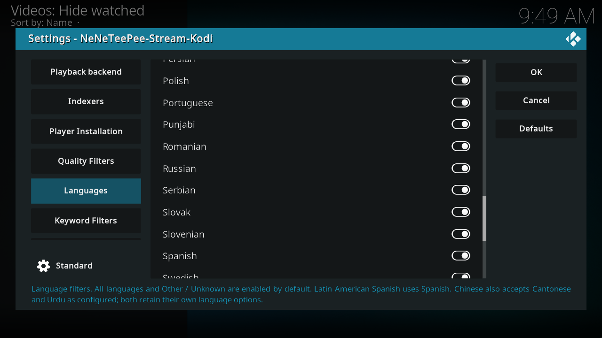
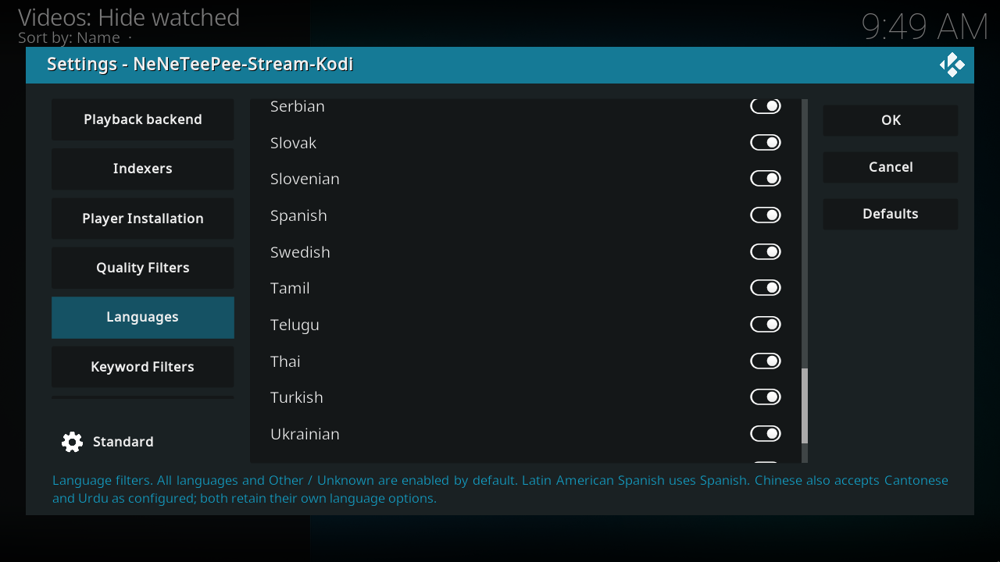
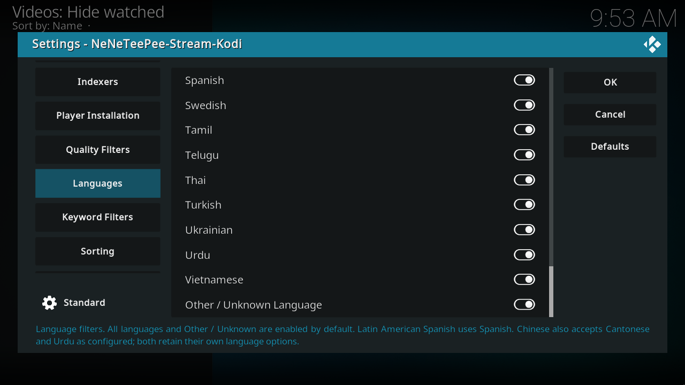

# Languages

Each switch allows releases tagged with that language. These are release-title metadata filters, not a choice of the audio track inside the media file. All 48 named languages and Other / Unknown Language start enabled. Spanish includes Latino. The current normalization also lets Chinese admit Cantonese and Urdu; those languages retain their own switches. Turn off Other / Unknown Language if you need explicit language metadata, accepting that untagged titles then disappear.

## Kodi screenshots

Captured on the OrbStack Kodi VM from commit `db07f61`. Debug overlays are off, and credentials use example values. [Capture details](index.md#capture-details).

## Every option

### Options

| Option and setting ID | Default | What it does |
| --- | --- | --- |
| Arabic[^source-filter_arabic] `filter_arabic` | On | Include Arabic releases. Matches the language name and ar, ara, without regard to capitalization. Multilingual releases pass when any selected language matches. |
| Bengali[^source-filter_bengali] `filter_bengali` | On | Include Bengali releases. Matches the language name and bn, ben, bangla, without regard to capitalization. Multilingual releases pass when any selected language matches. |
| Bulgarian[^source-filter_bulgarian] `filter_bulgarian` | On | Include Bulgarian releases. Matches the language name and bg, bul, without regard to capitalization. Multilingual releases pass when any selected language matches. |
| Cantonese[^source-filter_cantonese] `filter_cantonese` | On | Include Cantonese releases. Matches the language name and yue, cant, without regard to capitalization. Multilingual releases pass when any selected language matches. Cantonese is also accepted when Chinese is selected. |
| Chinese[^source-filter_chinese] `filter_chinese` | On | Include Chinese releases. Matches the language name and zh, chi, zho, mandarin, cmn, chs, cht, without regard to capitalization. Multilingual releases pass when any selected language matches. This selection also accepts Cantonese and Urdu under your configured filter grouping; they retain their own language identities and selections. |
| Croatian[^source-filter_croatian] `filter_croatian` | On | Include Croatian releases. Matches the language name and hr, hrv, without regard to capitalization. Multilingual releases pass when any selected language matches. |
| Czech[^source-filter_czech] `filter_czech` | On | Include Czech releases. Matches the language name and cs, cze, ces, without regard to capitalization. Multilingual releases pass when any selected language matches. |
| Danish[^source-filter_danish] `filter_danish` | On | Include Danish releases. Matches the language name and da, dan, without regard to capitalization. Multilingual releases pass when any selected language matches. |
| Dutch[^source-filter_dutch] `filter_dutch` | On | Include Dutch releases. Matches the language name and nl, dut, nld, without regard to capitalization. Multilingual releases pass when any selected language matches. |
| English[^source-filter_english] `filter_english` | On | Include English releases. Matches the language name and en, eng, without regard to capitalization. Multilingual releases pass when any selected language matches. |
| Estonian[^source-filter_estonian] `filter_estonian` | On | Include Estonian releases. Matches the language name and et, est, without regard to capitalization. Multilingual releases pass when any selected language matches. |
| Finnish[^source-filter_finnish] `filter_finnish` | On | Include Finnish releases. Matches the language name and fi, fin, without regard to capitalization. Multilingual releases pass when any selected language matches. |
| French[^source-filter_french] `filter_french` | On | Include French releases. Matches the language name and fr, fre, fra, vff, vf, vfq, vostfr, without regard to capitalization. Multilingual releases pass when any selected language matches. |
| German[^source-filter_german] `filter_german` | On | Include German releases. Matches the language name and de, ger, deu, without regard to capitalization. Multilingual releases pass when any selected language matches. |
| Greek[^source-filter_greek] `filter_greek` | On | Include Greek releases. Matches the language name and el, gre, ell, without regard to capitalization. Multilingual releases pass when any selected language matches. |
| Gujarati[^source-filter_gujarati] `filter_gujarati` | On | Include Gujarati releases. Matches the language name and gu, guj, without regard to capitalization. Multilingual releases pass when any selected language matches. |
| Hebrew[^source-filter_hebrew] `filter_hebrew` | On | Include Hebrew releases. Matches the language name and he, heb, without regard to capitalization. Multilingual releases pass when any selected language matches. |
| Hindi[^source-filter_hindi] `filter_hindi` | On | Include Hindi releases. Matches the language name and hi, hin, without regard to capitalization. Multilingual releases pass when any selected language matches. |
| Hungarian[^source-filter_hungarian] `filter_hungarian` | On | Include Hungarian releases. Matches the language name and hu, hun, without regard to capitalization. Multilingual releases pass when any selected language matches. |
| Indonesian[^source-filter_indonesian] `filter_indonesian` | On | Include Indonesian releases. Matches the language name and id, ind, without regard to capitalization. Multilingual releases pass when any selected language matches. |
| Italian[^source-filter_italian] `filter_italian` | On | Include Italian releases. Matches the language name and it, ita, without regard to capitalization. Multilingual releases pass when any selected language matches. |
| Japanese[^source-filter_japanese] `filter_japanese` | On | Include Japanese releases. Matches the language name and ja, jpn, jap, without regard to capitalization. Multilingual releases pass when any selected language matches. |
| Kannada[^source-filter_kannada] `filter_kannada` | On | Include Kannada releases. Matches the language name and kn, kan, without regard to capitalization. Multilingual releases pass when any selected language matches. |
| Korean[^source-filter_korean] `filter_korean` | On | Include Korean releases. Matches the language name and ko, kor, without regard to capitalization. Multilingual releases pass when any selected language matches. |
| Latvian[^source-filter_latvian] `filter_latvian` | On | Include Latvian releases. Matches the language name and lv, lav, without regard to capitalization. Multilingual releases pass when any selected language matches. |
| Lithuanian[^source-filter_lithuanian] `filter_lithuanian` | On | Include Lithuanian releases. Matches the language name and lt, lit, without regard to capitalization. Multilingual releases pass when any selected language matches. |
| Malay[^source-filter_malay] `filter_malay` | On | Include Malay releases. Matches the language name and ms, may, msa, without regard to capitalization. Multilingual releases pass when any selected language matches. |
| Malayalam[^source-filter_malayalam] `filter_malayalam` | On | Include Malayalam releases. Matches the language name and ml, mal, without regard to capitalization. Multilingual releases pass when any selected language matches. |
| Marathi[^source-filter_marathi] `filter_marathi` | On | Include Marathi releases. Matches the language name and mr, mar, without regard to capitalization. Multilingual releases pass when any selected language matches. |
| Norwegian[^source-filter_norwegian] `filter_norwegian` | On | Include Norwegian releases. Matches the language name and no, nor, nob, nno, nb, nn, without regard to capitalization. Multilingual releases pass when any selected language matches. |
| Persian[^source-filter_persian] `filter_persian` | On | Include Persian releases. Matches the language name and fa, per, fas, farsi, without regard to capitalization. Multilingual releases pass when any selected language matches. |
| Polish[^source-filter_polish] `filter_polish` | On | Include Polish releases. Matches the language name and pl, pol, without regard to capitalization. Multilingual releases pass when any selected language matches. |
| Portuguese[^source-filter_portuguese] `filter_portuguese` | On | Include Portuguese releases. Matches the language name and pt, por, without regard to capitalization. Multilingual releases pass when any selected language matches. |
| Punjabi[^source-filter_punjabi] `filter_punjabi` | On | Include Punjabi releases. Matches the language name and pa, pan, without regard to capitalization. Multilingual releases pass when any selected language matches. |
| Romanian[^source-filter_romanian] `filter_romanian` | On | Include Romanian releases. Matches the language name and ro, rum, ron, without regard to capitalization. Multilingual releases pass when any selected language matches. |
| Russian[^source-filter_russian] `filter_russian` | On | Include Russian releases. Matches the language name and ru, rus, without regard to capitalization. Multilingual releases pass when any selected language matches. |
| Serbian[^source-filter_serbian] `filter_serbian` | On | Include Serbian releases. Matches the language name and sr, srp, without regard to capitalization. Multilingual releases pass when any selected language matches. |
| Slovak[^source-filter_slovak] `filter_slovak` | On | Include Slovak releases. Matches the language name and sk, slo, slk, without regard to capitalization. Multilingual releases pass when any selected language matches. |
| Slovenian[^source-filter_slovenian] `filter_slovenian` | On | Include Slovenian releases. Matches the language name and sl, slv, without regard to capitalization. Multilingual releases pass when any selected language matches. |
| Spanish[^source-filter_spanish] `filter_spanish` | On | Include Spanish releases. Matches the language name and es, spa, esp, latino, latin, la, castellano, without regard to capitalization. Multilingual releases pass when any selected language matches. |
| Swedish[^source-filter_swedish] `filter_swedish` | On | Include Swedish releases. Matches the language name and sv, swe, without regard to capitalization. Multilingual releases pass when any selected language matches. |
| Tamil[^source-filter_tamil] `filter_tamil` | On | Include Tamil releases. Matches the language name and ta, tam, without regard to capitalization. Multilingual releases pass when any selected language matches. |
| Telugu[^source-filter_telugu] `filter_telugu` | On | Include Telugu releases. Matches the language name and te, tel, without regard to capitalization. Multilingual releases pass when any selected language matches. |
| Thai[^source-filter_thai] `filter_thai` | On | Include Thai releases. Matches the language name and th, tha, without regard to capitalization. Multilingual releases pass when any selected language matches. |
| Turkish[^source-filter_turkish] `filter_turkish` | On | Include Turkish releases. Matches the language name and tr, tur, without regard to capitalization. Multilingual releases pass when any selected language matches. |
| Ukrainian[^source-filter_ukrainian] `filter_ukrainian` | On | Include Ukrainian releases. Matches the language name and uk, ukr, without regard to capitalization. Multilingual releases pass when any selected language matches. |
| Urdu[^source-filter_urdu] `filter_urdu` | On | Include Urdu releases. Matches the language name and ur, urd, urdo, without regard to capitalization. Multilingual releases pass when any selected language matches. The spelling Urdo is accepted. Urdu is also accepted when Chinese is selected under your configured grouping. |
| Vietnamese[^source-filter_vietnamese] `filter_vietnamese` | On | Include Vietnamese releases. Matches the language name and vi, vie, without regard to capitalization. Multilingual releases pass when any selected language matches. |
| Other / Unknown Language[^source-filter_unknown_language] `filter_unknown_language` | On | Allow releases with no recognized language, or an unlisted value. Enabled by default. This does not bypass selections for recognized language values. |

## Source notes

Labels and schema defaults are from commit [`db07f61`](https://github.com/Appz4Fun/NeNeTeePee-Stream-Kodi/blob/db07f61d4090a0c89ec8461ee9b3ca34f9607aa6/repo/plugin.video.nzbdav/resources/settings.xml). Runtime limits can differ from the editable schema; the explanations identify those limits. Links use the full commit ID, so later changes to `main` do not move them.

[^source-filter_arabic]: [Setting declaration](https://github.com/Appz4Fun/NeNeTeePee-Stream-Kodi/blob/db07f61d4090a0c89ec8461ee9b3ca34f9607aa6/repo/plugin.video.nzbdav/resources/settings.xml#L971).
[^source-filter_bengali]: [Setting declaration](https://github.com/Appz4Fun/NeNeTeePee-Stream-Kodi/blob/db07f61d4090a0c89ec8461ee9b3ca34f9607aa6/repo/plugin.video.nzbdav/resources/settings.xml#L976).
[^source-filter_bulgarian]: [Setting declaration](https://github.com/Appz4Fun/NeNeTeePee-Stream-Kodi/blob/db07f61d4090a0c89ec8461ee9b3ca34f9607aa6/repo/plugin.video.nzbdav/resources/settings.xml#L981).
[^source-filter_cantonese]: [Setting declaration](https://github.com/Appz4Fun/NeNeTeePee-Stream-Kodi/blob/db07f61d4090a0c89ec8461ee9b3ca34f9607aa6/repo/plugin.video.nzbdav/resources/settings.xml#L986).
[^source-filter_chinese]: [Setting declaration](https://github.com/Appz4Fun/NeNeTeePee-Stream-Kodi/blob/db07f61d4090a0c89ec8461ee9b3ca34f9607aa6/repo/plugin.video.nzbdav/resources/settings.xml#L991).
[^source-filter_croatian]: [Setting declaration](https://github.com/Appz4Fun/NeNeTeePee-Stream-Kodi/blob/db07f61d4090a0c89ec8461ee9b3ca34f9607aa6/repo/plugin.video.nzbdav/resources/settings.xml#L996).
[^source-filter_czech]: [Setting declaration](https://github.com/Appz4Fun/NeNeTeePee-Stream-Kodi/blob/db07f61d4090a0c89ec8461ee9b3ca34f9607aa6/repo/plugin.video.nzbdav/resources/settings.xml#L1001).
[^source-filter_danish]: [Setting declaration](https://github.com/Appz4Fun/NeNeTeePee-Stream-Kodi/blob/db07f61d4090a0c89ec8461ee9b3ca34f9607aa6/repo/plugin.video.nzbdav/resources/settings.xml#L1006).
[^source-filter_dutch]: [Setting declaration](https://github.com/Appz4Fun/NeNeTeePee-Stream-Kodi/blob/db07f61d4090a0c89ec8461ee9b3ca34f9607aa6/repo/plugin.video.nzbdav/resources/settings.xml#L1011).
[^source-filter_english]: [Setting declaration](https://github.com/Appz4Fun/NeNeTeePee-Stream-Kodi/blob/db07f61d4090a0c89ec8461ee9b3ca34f9607aa6/repo/plugin.video.nzbdav/resources/settings.xml#L1016).
[^source-filter_estonian]: [Setting declaration](https://github.com/Appz4Fun/NeNeTeePee-Stream-Kodi/blob/db07f61d4090a0c89ec8461ee9b3ca34f9607aa6/repo/plugin.video.nzbdav/resources/settings.xml#L1021).
[^source-filter_finnish]: [Setting declaration](https://github.com/Appz4Fun/NeNeTeePee-Stream-Kodi/blob/db07f61d4090a0c89ec8461ee9b3ca34f9607aa6/repo/plugin.video.nzbdav/resources/settings.xml#L1026).
[^source-filter_french]: [Setting declaration](https://github.com/Appz4Fun/NeNeTeePee-Stream-Kodi/blob/db07f61d4090a0c89ec8461ee9b3ca34f9607aa6/repo/plugin.video.nzbdav/resources/settings.xml#L1031).
[^source-filter_german]: [Setting declaration](https://github.com/Appz4Fun/NeNeTeePee-Stream-Kodi/blob/db07f61d4090a0c89ec8461ee9b3ca34f9607aa6/repo/plugin.video.nzbdav/resources/settings.xml#L1036).
[^source-filter_greek]: [Setting declaration](https://github.com/Appz4Fun/NeNeTeePee-Stream-Kodi/blob/db07f61d4090a0c89ec8461ee9b3ca34f9607aa6/repo/plugin.video.nzbdav/resources/settings.xml#L1041).
[^source-filter_gujarati]: [Setting declaration](https://github.com/Appz4Fun/NeNeTeePee-Stream-Kodi/blob/db07f61d4090a0c89ec8461ee9b3ca34f9607aa6/repo/plugin.video.nzbdav/resources/settings.xml#L1046).
[^source-filter_hebrew]: [Setting declaration](https://github.com/Appz4Fun/NeNeTeePee-Stream-Kodi/blob/db07f61d4090a0c89ec8461ee9b3ca34f9607aa6/repo/plugin.video.nzbdav/resources/settings.xml#L1051).
[^source-filter_hindi]: [Setting declaration](https://github.com/Appz4Fun/NeNeTeePee-Stream-Kodi/blob/db07f61d4090a0c89ec8461ee9b3ca34f9607aa6/repo/plugin.video.nzbdav/resources/settings.xml#L1056).
[^source-filter_hungarian]: [Setting declaration](https://github.com/Appz4Fun/NeNeTeePee-Stream-Kodi/blob/db07f61d4090a0c89ec8461ee9b3ca34f9607aa6/repo/plugin.video.nzbdav/resources/settings.xml#L1061).
[^source-filter_indonesian]: [Setting declaration](https://github.com/Appz4Fun/NeNeTeePee-Stream-Kodi/blob/db07f61d4090a0c89ec8461ee9b3ca34f9607aa6/repo/plugin.video.nzbdav/resources/settings.xml#L1066).
[^source-filter_italian]: [Setting declaration](https://github.com/Appz4Fun/NeNeTeePee-Stream-Kodi/blob/db07f61d4090a0c89ec8461ee9b3ca34f9607aa6/repo/plugin.video.nzbdav/resources/settings.xml#L1071).
[^source-filter_japanese]: [Setting declaration](https://github.com/Appz4Fun/NeNeTeePee-Stream-Kodi/blob/db07f61d4090a0c89ec8461ee9b3ca34f9607aa6/repo/plugin.video.nzbdav/resources/settings.xml#L1076).
[^source-filter_kannada]: [Setting declaration](https://github.com/Appz4Fun/NeNeTeePee-Stream-Kodi/blob/db07f61d4090a0c89ec8461ee9b3ca34f9607aa6/repo/plugin.video.nzbdav/resources/settings.xml#L1081).
[^source-filter_korean]: [Setting declaration](https://github.com/Appz4Fun/NeNeTeePee-Stream-Kodi/blob/db07f61d4090a0c89ec8461ee9b3ca34f9607aa6/repo/plugin.video.nzbdav/resources/settings.xml#L1086).
[^source-filter_latvian]: [Setting declaration](https://github.com/Appz4Fun/NeNeTeePee-Stream-Kodi/blob/db07f61d4090a0c89ec8461ee9b3ca34f9607aa6/repo/plugin.video.nzbdav/resources/settings.xml#L1091).
[^source-filter_lithuanian]: [Setting declaration](https://github.com/Appz4Fun/NeNeTeePee-Stream-Kodi/blob/db07f61d4090a0c89ec8461ee9b3ca34f9607aa6/repo/plugin.video.nzbdav/resources/settings.xml#L1096).
[^source-filter_malay]: [Setting declaration](https://github.com/Appz4Fun/NeNeTeePee-Stream-Kodi/blob/db07f61d4090a0c89ec8461ee9b3ca34f9607aa6/repo/plugin.video.nzbdav/resources/settings.xml#L1101).
[^source-filter_malayalam]: [Setting declaration](https://github.com/Appz4Fun/NeNeTeePee-Stream-Kodi/blob/db07f61d4090a0c89ec8461ee9b3ca34f9607aa6/repo/plugin.video.nzbdav/resources/settings.xml#L1106).
[^source-filter_marathi]: [Setting declaration](https://github.com/Appz4Fun/NeNeTeePee-Stream-Kodi/blob/db07f61d4090a0c89ec8461ee9b3ca34f9607aa6/repo/plugin.video.nzbdav/resources/settings.xml#L1111).
[^source-filter_norwegian]: [Setting declaration](https://github.com/Appz4Fun/NeNeTeePee-Stream-Kodi/blob/db07f61d4090a0c89ec8461ee9b3ca34f9607aa6/repo/plugin.video.nzbdav/resources/settings.xml#L1116).
[^source-filter_persian]: [Setting declaration](https://github.com/Appz4Fun/NeNeTeePee-Stream-Kodi/blob/db07f61d4090a0c89ec8461ee9b3ca34f9607aa6/repo/plugin.video.nzbdav/resources/settings.xml#L1121).
[^source-filter_polish]: [Setting declaration](https://github.com/Appz4Fun/NeNeTeePee-Stream-Kodi/blob/db07f61d4090a0c89ec8461ee9b3ca34f9607aa6/repo/plugin.video.nzbdav/resources/settings.xml#L1126).
[^source-filter_portuguese]: [Setting declaration](https://github.com/Appz4Fun/NeNeTeePee-Stream-Kodi/blob/db07f61d4090a0c89ec8461ee9b3ca34f9607aa6/repo/plugin.video.nzbdav/resources/settings.xml#L1131).
[^source-filter_punjabi]: [Setting declaration](https://github.com/Appz4Fun/NeNeTeePee-Stream-Kodi/blob/db07f61d4090a0c89ec8461ee9b3ca34f9607aa6/repo/plugin.video.nzbdav/resources/settings.xml#L1136).
[^source-filter_romanian]: [Setting declaration](https://github.com/Appz4Fun/NeNeTeePee-Stream-Kodi/blob/db07f61d4090a0c89ec8461ee9b3ca34f9607aa6/repo/plugin.video.nzbdav/resources/settings.xml#L1141).
[^source-filter_russian]: [Setting declaration](https://github.com/Appz4Fun/NeNeTeePee-Stream-Kodi/blob/db07f61d4090a0c89ec8461ee9b3ca34f9607aa6/repo/plugin.video.nzbdav/resources/settings.xml#L1146).
[^source-filter_serbian]: [Setting declaration](https://github.com/Appz4Fun/NeNeTeePee-Stream-Kodi/blob/db07f61d4090a0c89ec8461ee9b3ca34f9607aa6/repo/plugin.video.nzbdav/resources/settings.xml#L1151).
[^source-filter_slovak]: [Setting declaration](https://github.com/Appz4Fun/NeNeTeePee-Stream-Kodi/blob/db07f61d4090a0c89ec8461ee9b3ca34f9607aa6/repo/plugin.video.nzbdav/resources/settings.xml#L1156).
[^source-filter_slovenian]: [Setting declaration](https://github.com/Appz4Fun/NeNeTeePee-Stream-Kodi/blob/db07f61d4090a0c89ec8461ee9b3ca34f9607aa6/repo/plugin.video.nzbdav/resources/settings.xml#L1161).
[^source-filter_spanish]: [Setting declaration](https://github.com/Appz4Fun/NeNeTeePee-Stream-Kodi/blob/db07f61d4090a0c89ec8461ee9b3ca34f9607aa6/repo/plugin.video.nzbdav/resources/settings.xml#L1166).
[^source-filter_swedish]: [Setting declaration](https://github.com/Appz4Fun/NeNeTeePee-Stream-Kodi/blob/db07f61d4090a0c89ec8461ee9b3ca34f9607aa6/repo/plugin.video.nzbdav/resources/settings.xml#L1171).
[^source-filter_tamil]: [Setting declaration](https://github.com/Appz4Fun/NeNeTeePee-Stream-Kodi/blob/db07f61d4090a0c89ec8461ee9b3ca34f9607aa6/repo/plugin.video.nzbdav/resources/settings.xml#L1176).
[^source-filter_telugu]: [Setting declaration](https://github.com/Appz4Fun/NeNeTeePee-Stream-Kodi/blob/db07f61d4090a0c89ec8461ee9b3ca34f9607aa6/repo/plugin.video.nzbdav/resources/settings.xml#L1181).
[^source-filter_thai]: [Setting declaration](https://github.com/Appz4Fun/NeNeTeePee-Stream-Kodi/blob/db07f61d4090a0c89ec8461ee9b3ca34f9607aa6/repo/plugin.video.nzbdav/resources/settings.xml#L1186).
[^source-filter_turkish]: [Setting declaration](https://github.com/Appz4Fun/NeNeTeePee-Stream-Kodi/blob/db07f61d4090a0c89ec8461ee9b3ca34f9607aa6/repo/plugin.video.nzbdav/resources/settings.xml#L1191).
[^source-filter_ukrainian]: [Setting declaration](https://github.com/Appz4Fun/NeNeTeePee-Stream-Kodi/blob/db07f61d4090a0c89ec8461ee9b3ca34f9607aa6/repo/plugin.video.nzbdav/resources/settings.xml#L1196).
[^source-filter_urdu]: [Setting declaration](https://github.com/Appz4Fun/NeNeTeePee-Stream-Kodi/blob/db07f61d4090a0c89ec8461ee9b3ca34f9607aa6/repo/plugin.video.nzbdav/resources/settings.xml#L1201).
[^source-filter_vietnamese]: [Setting declaration](https://github.com/Appz4Fun/NeNeTeePee-Stream-Kodi/blob/db07f61d4090a0c89ec8461ee9b3ca34f9607aa6/repo/plugin.video.nzbdav/resources/settings.xml#L1206).
[^source-filter_unknown_language]: [Setting declaration](https://github.com/Appz4Fun/NeNeTeePee-Stream-Kodi/blob/db07f61d4090a0c89ec8461ee9b3ca34f9607aa6/repo/plugin.video.nzbdav/resources/settings.xml#L1211); [runtime reference](https://github.com/Appz4Fun/NeNeTeePee-Stream-Kodi/blob/db07f61d4090a0c89ec8461ee9b3ca34f9607aa6/repo/plugin.video.nzbdav/resources/lib/filter_options.py#L68).
