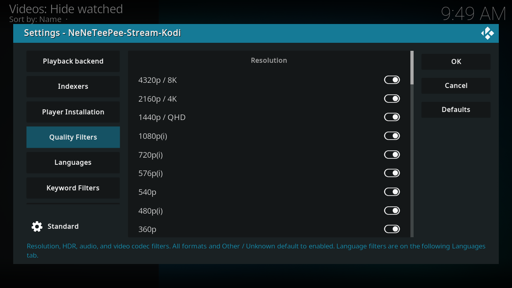
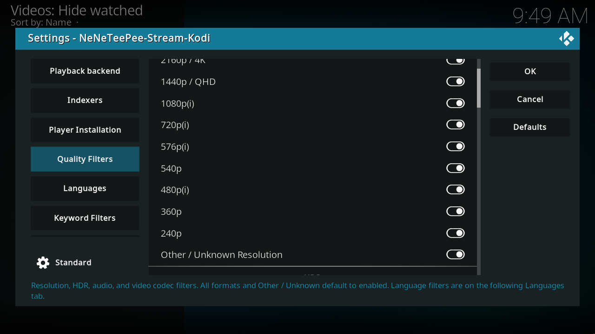
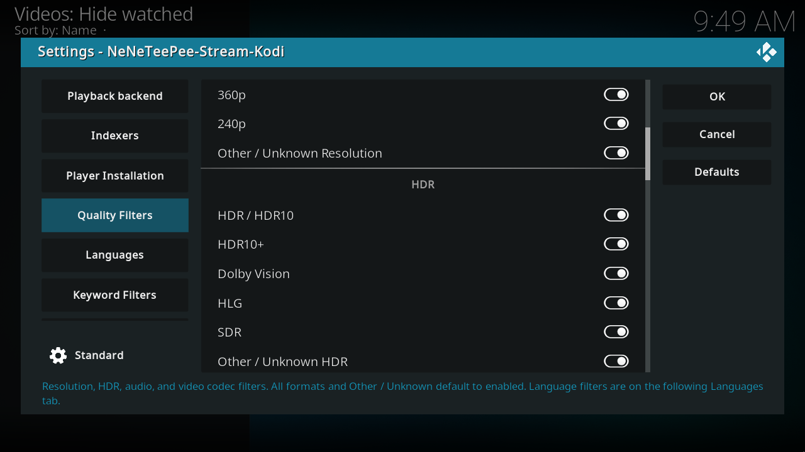
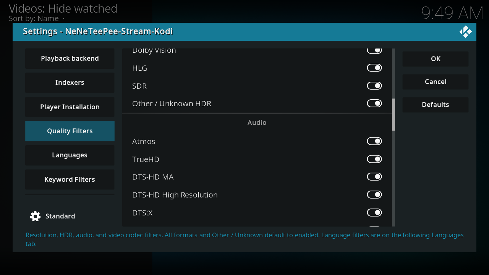
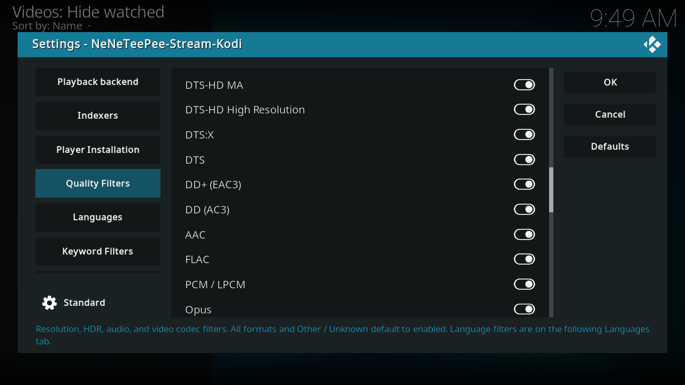
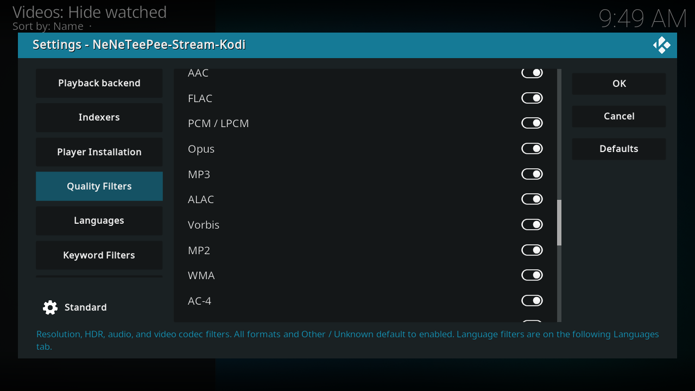
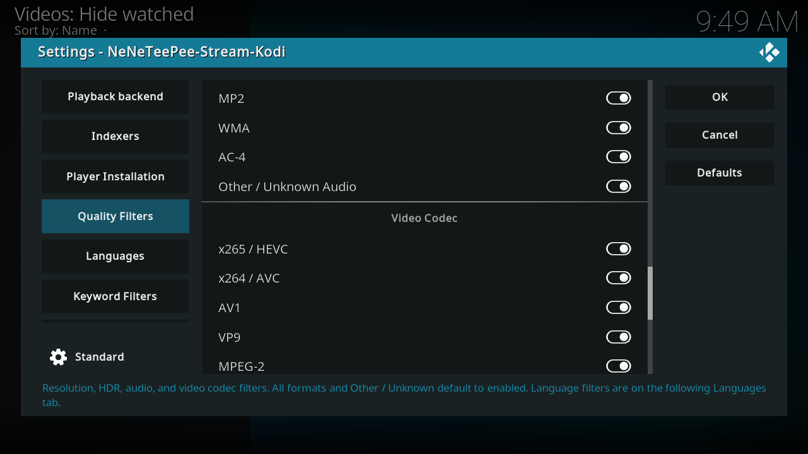
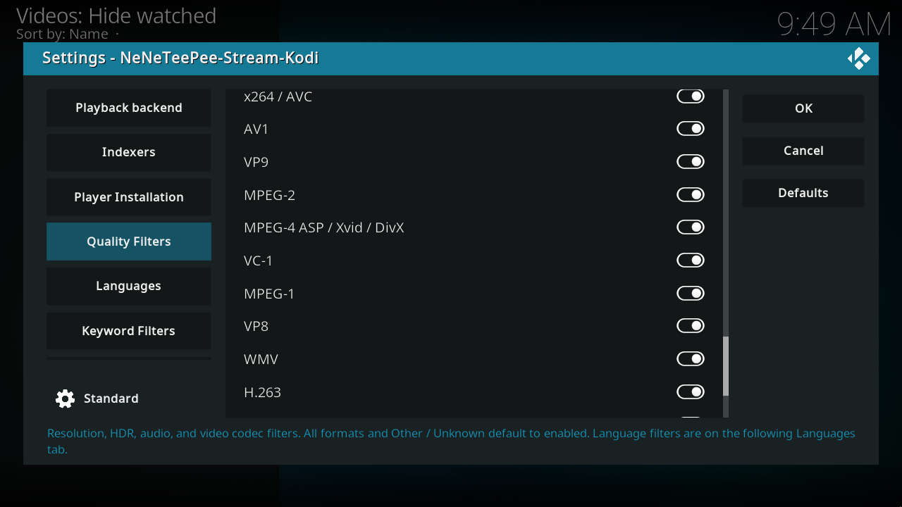
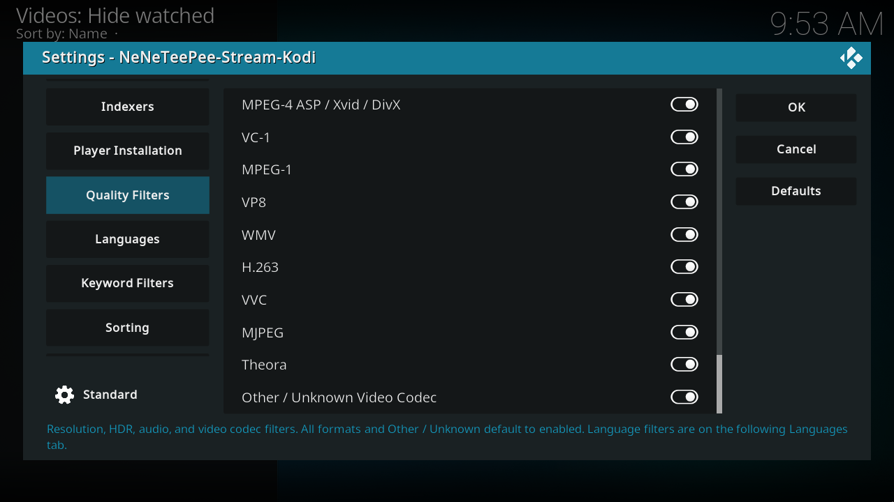

# Quality filters

These switches control which releases remain in the picker. Every format starts enabled. Turn off formats your device cannot play, then use Sorting to order the remaining releases. A recognized value must pass its format switch; Other / Unknown admits missing or unlisted metadata, not a recognized format you excluded. Titles are parsed into resolution, HDR, audio, and video codec metadata. A release can contain several recognized audio or HDR tags; matching an enabled tag can admit it. Filtering does not transcode or repair a file.

## Kodi screenshots

Captured on the OrbStack Kodi VM from commit `db07f61`. Debug overlays are off, and credentials use example values. [Capture details](index.md#capture-details).

## Every option

### Resolution

| Option and setting ID | Default | What it does |
| --- | --- | --- |
| 4320p / 8K[^source-filter_4320p] `filter_4320p` | On | Include 8K / 4320p releases, including titles containing 7680x4320. Missing or unlisted metadata follows Other / Unknown in this category. |
| 2160p / 4K[^source-filter_2160p] `filter_2160p` | On | Include 2160p / 4K releases. Missing or unlisted metadata follows the Other / Unknown option in this category. |
| 1440p / QHD[^source-filter_1440p] `filter_1440p` | On | Include 1440p / QHD releases, including titles containing 2560x1440. Missing or unlisted metadata follows Other / Unknown in this category. |
| 1080p(i)[^source-filter_1080p] `filter_1080p` | On | Include both 1080p and interlaced 1080i releases. Missing or unlisted metadata follows the Other / Unknown option in this category. |
| 720p(i)[^source-filter_720p] `filter_720p` | On | Include both 720p and interlaced 720i releases. Missing or unlisted metadata follows the Other / Unknown option in this category. |
| 576p(i)[^source-filter_576p] `filter_576p` | On | Include 576p and interlaced 576i releases. Missing or unlisted metadata follows Other / Unknown in this category. |
| 540p[^source-filter_540p] `filter_540p` | On | Include 540p releases, including 960x540. Missing or unlisted metadata follows Other / Unknown in this category. |
| 480p(i)[^source-filter_480p] `filter_480p` | On | Include both 480p and interlaced 480i releases. Missing or unlisted metadata follows the Other / Unknown option in this category. |
| 360p[^source-filter_360p] `filter_360p` | On | Include 360p releases, including 640x360. Missing or unlisted metadata follows Other / Unknown in this category. |
| 240p[^source-filter_240p] `filter_240p` | On | Include 240p releases, including 320x240. Missing or unlisted metadata follows Other / Unknown in this category. |
| Other / Unknown Resolution[^source-filter_unknown_resolution] `filter_unknown_resolution` | On | Allow releases with no recognized resolution, or an unlisted value. Enabled by default. This does not bypass selections for recognized resolution values. |

### HDR

| Option and setting ID | Default | What it does |
| --- | --- | --- |
| HDR / HDR10[^source-filter_hdr10] `filter_hdr10` | On | Include releases explicitly tagged HDR or HDR10. Missing or unlisted metadata follows the Other / Unknown option in this category. |
| HDR10+[^source-filter_hdr10plus] `filter_hdr10plus` | On | Include HDR10+, HDR+, HDRPlus, HDR10Plus, and HDR10P title tags. Missing or unlisted metadata follows the Other / Unknown option in this category. |
| Dolby Vision[^source-filter_dolby_vision] `filter_dolby_vision` | On | Include releases explicitly tagged DV, DoVi, or Dolby Vision. Missing or unlisted metadata follows the Other / Unknown option in this category. |
| HLG[^source-filter_hlg] `filter_hlg` | On | Include HLG releases. Missing or unlisted metadata follows the Other / Unknown option in this category. |
| SDR[^source-filter_sdr] `filter_sdr` | On | Include SDR releases. Missing or unlisted metadata follows the Other / Unknown option in this category. |
| Other / Unknown HDR[^source-filter_unknown_hdr] `filter_unknown_hdr` | On | Allow releases with no recognized HDR / dynamic-range tag, or an unlisted value. Enabled by default. This does not bypass selections for recognized HDR / dynamic-range tag values. |

### Audio

| Option and setting ID | Default | What it does |
| --- | --- | --- |
| Atmos[^source-filter_atmos] `filter_atmos` | On | Include Atmos releases. Missing or unlisted metadata follows the Other / Unknown option in this category. |
| TrueHD[^source-filter_truehd] `filter_truehd` | On | Include TrueHD releases. Missing or unlisted metadata follows the Other / Unknown option in this category. |
| DTS-HD MA[^source-filter_dtshd_ma] `filter_dtshd_ma` | On | Include DTS-HD MA releases. Missing or unlisted metadata follows the Other / Unknown option in this category. |
| DTS-HD High Resolution[^source-filter_dtshd_hr] `filter_dtshd_hr` | On | Include DTS-HD High Resolution (DTS-HD HR / HRA). This is a separate selection from DTS core and lossless DTS-HD Master Audio. Missing or unlisted metadata follows Other / Unknown in this category. |
| DTS:X[^source-filter_dtsx] `filter_dtsx` | On | Include DTS:X releases. Missing or unlisted metadata follows the Other / Unknown option in this category. |
| DTS[^source-filter_dts] `filter_dts` | On | Include standard DTS / DTS core audio. DTS is classified separately from Dolby Digital and DTS-HD. Missing or unlisted metadata follows Other / Unknown in this category. |
| DD+ (EAC3)[^source-filter_ddplus] `filter_ddplus` | On | Include DD+ (EAC3) releases. Missing or unlisted metadata follows the Other / Unknown option in this category. |
| DD (AC3)[^source-filter_dd] `filter_dd` | On | Include DD (AC3) releases. Missing or unlisted metadata follows the Other / Unknown option in this category. |
| AAC[^source-filter_aac] `filter_aac` | On | Include AAC releases. Missing or unlisted metadata follows the Other / Unknown option in this category. |
| FLAC[^source-filter_flac] `filter_flac` | On | Include FLAC lossless audio. This includes mono and stereo remux releases. Missing or unlisted metadata follows Other / Unknown in this category. |
| PCM / LPCM[^source-filter_pcm] `filter_pcm` | On | Include uncompressed PCM and LPCM audio. Missing or unlisted metadata follows Other / Unknown in this category. |
| Opus[^source-filter_opus] `filter_opus` | On | Include Opus audio. OPUS, Opus, and opus are recognized equally. Missing or unlisted metadata follows Other / Unknown in this category. |
| MP3[^source-filter_mp3] `filter_mp3` | On | Include MP3 / MPEG Audio Layer III audio. Missing or unlisted metadata follows Other / Unknown in this category. |
| ALAC[^source-filter_alac] `filter_alac` | On | Include Apple Lossless (ALAC) audio. Missing or unlisted metadata follows Other / Unknown in this category. |
| Vorbis[^source-filter_vorbis] `filter_vorbis` | On | Include Vorbis / Ogg Vorbis audio. Missing or unlisted metadata follows Other / Unknown in this category. |
| MP2[^source-filter_mp2] `filter_mp2` | On | Include MP2 / MPEG Audio Layer II audio. Missing or unlisted metadata follows Other / Unknown in this category. |
| WMA[^source-filter_wma] `filter_wma` | On | Include Windows Media Audio (WMA). Missing or unlisted metadata follows Other / Unknown in this category. |
| AC-4[^source-filter_ac4] `filter_ac4` | On | Include Dolby AC-4 audio. AC-4 has its own selection separate from AC-3 and E-AC-3. Missing or unlisted metadata follows Other / Unknown in this category. |
| Other / Unknown Audio[^source-filter_unknown_audio] `filter_unknown_audio` | On | Allow releases with no recognized audio format, or an unlisted value. Enabled by default. This does not bypass selections for recognized audio format values. |

### Video codec

| Option and setting ID | Default | What it does |
| --- | --- | --- |
| x265 / HEVC[^source-filter_hevc] `filter_hevc` | On | Include x265 / HEVC releases. Missing or unlisted metadata follows the Other / Unknown option in this category. |
| x264 / AVC[^source-filter_avc] `filter_avc` | On | Include x264 / AVC releases. Missing or unlisted metadata follows the Other / Unknown option in this category. |
| AV1[^source-filter_av1] `filter_av1` | On | Include AV1 releases. Missing or unlisted metadata follows the Other / Unknown option in this category. |
| VP9[^source-filter_vp9] `filter_vp9` | On | Include VP9 releases. Missing or unlisted metadata follows the Other / Unknown option in this category. |
| MPEG-2[^source-filter_mpeg2] `filter_mpeg2` | On | Include MPEG-2 releases. Missing or unlisted metadata follows the Other / Unknown option in this category. |
| MPEG-4 ASP / Xvid / DivX[^source-filter_mpeg4] `filter_mpeg4` | On | Include MPEG-4 ASP video, including Xvid and DivX. This is separate from H.264 / AVC. Missing or unlisted metadata follows Other / Unknown in this category. |
| VC-1[^source-filter_vc1] `filter_vc1` | On | Include VC-1 / WVC1 video, found on some Blu-ray and HD DVD releases. Missing or unlisted metadata follows Other / Unknown in this category. |
| MPEG-1[^source-filter_mpeg1] `filter_mpeg1` | On | Include MPEG-1 video. Missing or unlisted metadata follows Other / Unknown in this category. |
| VP8[^source-filter_vp8] `filter_vp8` | On | Include VP8 video. VP9 has its own selection. Missing or unlisted metadata follows Other / Unknown in this category. |
| WMV[^source-filter_wmv] `filter_wmv` | On | Include Windows Media Video (WMV). VC-1 has its own selection. Missing or unlisted metadata follows Other / Unknown in this category. |
| H.263[^source-filter_h263] `filter_h263` | On | Include H.263 video. H.264 / AVC has its own selection. Missing or unlisted metadata follows Other / Unknown in this category. |
| VVC[^source-filter_vvc] `filter_vvc` | On | Include VVC / H.266 video. Matching a release does not guarantee your device can decode it. Missing or unlisted metadata follows Other / Unknown in this category. |
| MJPEG[^source-filter_mjpeg] `filter_mjpeg` | On | Include Motion JPEG / MJPEG video. Missing or unlisted metadata follows Other / Unknown in this category. |
| Theora[^source-filter_theora] `filter_theora` | On | Include Theora video. Missing or unlisted metadata follows Other / Unknown in this category. |
| Other / Unknown Video Codec[^source-filter_unknown_codec] `filter_unknown_codec` | On | Allow releases with no recognized video codec, or an unlisted value. Enabled by default. This does not bypass selections for recognized video codec values. |

## Source notes

Labels and schema defaults are from commit [`db07f61`](https://github.com/Appz4Fun/NeNeTeePee-Stream-Kodi/blob/db07f61d4090a0c89ec8461ee9b3ca34f9607aa6/repo/plugin.video.nzbdav/resources/settings.xml). Runtime limits can differ from the editable schema; the explanations identify those limits. Links use the full commit ID, so later changes to `main` do not move them.

[^source-filter_4320p]: [Setting declaration](https://github.com/Appz4Fun/NeNeTeePee-Stream-Kodi/blob/db07f61d4090a0c89ec8461ee9b3ca34f9607aa6/repo/plugin.video.nzbdav/resources/settings.xml#L706); [runtime reference](https://github.com/Appz4Fun/NeNeTeePee-Stream-Kodi/blob/db07f61d4090a0c89ec8461ee9b3ca34f9607aa6/repo/plugin.video.nzbdav/resources/lib/filter_options.py#L7).
[^source-filter_2160p]: [Setting declaration](https://github.com/Appz4Fun/NeNeTeePee-Stream-Kodi/blob/db07f61d4090a0c89ec8461ee9b3ca34f9607aa6/repo/plugin.video.nzbdav/resources/settings.xml#L711); [runtime reference](https://github.com/Appz4Fun/NeNeTeePee-Stream-Kodi/blob/db07f61d4090a0c89ec8461ee9b3ca34f9607aa6/repo/plugin.video.nzbdav/resources/lib/filter_options.py#L8).
[^source-filter_1440p]: [Setting declaration](https://github.com/Appz4Fun/NeNeTeePee-Stream-Kodi/blob/db07f61d4090a0c89ec8461ee9b3ca34f9607aa6/repo/plugin.video.nzbdav/resources/settings.xml#L716); [runtime reference](https://github.com/Appz4Fun/NeNeTeePee-Stream-Kodi/blob/db07f61d4090a0c89ec8461ee9b3ca34f9607aa6/repo/plugin.video.nzbdav/resources/lib/filter_options.py#L9).
[^source-filter_1080p]: [Setting declaration](https://github.com/Appz4Fun/NeNeTeePee-Stream-Kodi/blob/db07f61d4090a0c89ec8461ee9b3ca34f9607aa6/repo/plugin.video.nzbdav/resources/settings.xml#L721); [runtime reference](https://github.com/Appz4Fun/NeNeTeePee-Stream-Kodi/blob/db07f61d4090a0c89ec8461ee9b3ca34f9607aa6/repo/plugin.video.nzbdav/resources/lib/filter_options.py#L10).
[^source-filter_720p]: [Setting declaration](https://github.com/Appz4Fun/NeNeTeePee-Stream-Kodi/blob/db07f61d4090a0c89ec8461ee9b3ca34f9607aa6/repo/plugin.video.nzbdav/resources/settings.xml#L726); [runtime reference](https://github.com/Appz4Fun/NeNeTeePee-Stream-Kodi/blob/db07f61d4090a0c89ec8461ee9b3ca34f9607aa6/repo/plugin.video.nzbdav/resources/lib/filter_options.py#L11).
[^source-filter_576p]: [Setting declaration](https://github.com/Appz4Fun/NeNeTeePee-Stream-Kodi/blob/db07f61d4090a0c89ec8461ee9b3ca34f9607aa6/repo/plugin.video.nzbdav/resources/settings.xml#L731); [runtime reference](https://github.com/Appz4Fun/NeNeTeePee-Stream-Kodi/blob/db07f61d4090a0c89ec8461ee9b3ca34f9607aa6/repo/plugin.video.nzbdav/resources/lib/filter_options.py#L12).
[^source-filter_540p]: [Setting declaration](https://github.com/Appz4Fun/NeNeTeePee-Stream-Kodi/blob/db07f61d4090a0c89ec8461ee9b3ca34f9607aa6/repo/plugin.video.nzbdav/resources/settings.xml#L736); [runtime reference](https://github.com/Appz4Fun/NeNeTeePee-Stream-Kodi/blob/db07f61d4090a0c89ec8461ee9b3ca34f9607aa6/repo/plugin.video.nzbdav/resources/lib/filter_options.py#L13).
[^source-filter_480p]: [Setting declaration](https://github.com/Appz4Fun/NeNeTeePee-Stream-Kodi/blob/db07f61d4090a0c89ec8461ee9b3ca34f9607aa6/repo/plugin.video.nzbdav/resources/settings.xml#L741); [runtime reference](https://github.com/Appz4Fun/NeNeTeePee-Stream-Kodi/blob/db07f61d4090a0c89ec8461ee9b3ca34f9607aa6/repo/plugin.video.nzbdav/resources/lib/filter_options.py#L14).
[^source-filter_360p]: [Setting declaration](https://github.com/Appz4Fun/NeNeTeePee-Stream-Kodi/blob/db07f61d4090a0c89ec8461ee9b3ca34f9607aa6/repo/plugin.video.nzbdav/resources/settings.xml#L746); [runtime reference](https://github.com/Appz4Fun/NeNeTeePee-Stream-Kodi/blob/db07f61d4090a0c89ec8461ee9b3ca34f9607aa6/repo/plugin.video.nzbdav/resources/lib/filter_options.py#L15).
[^source-filter_240p]: [Setting declaration](https://github.com/Appz4Fun/NeNeTeePee-Stream-Kodi/blob/db07f61d4090a0c89ec8461ee9b3ca34f9607aa6/repo/plugin.video.nzbdav/resources/settings.xml#L751); [runtime reference](https://github.com/Appz4Fun/NeNeTeePee-Stream-Kodi/blob/db07f61d4090a0c89ec8461ee9b3ca34f9607aa6/repo/plugin.video.nzbdav/resources/lib/filter_options.py#L16).
[^source-filter_unknown_resolution]: [Setting declaration](https://github.com/Appz4Fun/NeNeTeePee-Stream-Kodi/blob/db07f61d4090a0c89ec8461ee9b3ca34f9607aa6/repo/plugin.video.nzbdav/resources/settings.xml#L756); [runtime reference](https://github.com/Appz4Fun/NeNeTeePee-Stream-Kodi/blob/db07f61d4090a0c89ec8461ee9b3ca34f9607aa6/repo/plugin.video.nzbdav/resources/lib/filter_options.py#L64).
[^source-filter_hdr10]: [Setting declaration](https://github.com/Appz4Fun/NeNeTeePee-Stream-Kodi/blob/db07f61d4090a0c89ec8461ee9b3ca34f9607aa6/repo/plugin.video.nzbdav/resources/settings.xml#L763); [runtime reference](https://github.com/Appz4Fun/NeNeTeePee-Stream-Kodi/blob/db07f61d4090a0c89ec8461ee9b3ca34f9607aa6/repo/plugin.video.nzbdav/resources/lib/filter_options.py#L19).
[^source-filter_hdr10plus]: [Setting declaration](https://github.com/Appz4Fun/NeNeTeePee-Stream-Kodi/blob/db07f61d4090a0c89ec8461ee9b3ca34f9607aa6/repo/plugin.video.nzbdav/resources/settings.xml#L768); [runtime reference](https://github.com/Appz4Fun/NeNeTeePee-Stream-Kodi/blob/db07f61d4090a0c89ec8461ee9b3ca34f9607aa6/repo/plugin.video.nzbdav/resources/lib/filter_options.py#L20).
[^source-filter_dolby_vision]: [Setting declaration](https://github.com/Appz4Fun/NeNeTeePee-Stream-Kodi/blob/db07f61d4090a0c89ec8461ee9b3ca34f9607aa6/repo/plugin.video.nzbdav/resources/settings.xml#L773); [runtime reference](https://github.com/Appz4Fun/NeNeTeePee-Stream-Kodi/blob/db07f61d4090a0c89ec8461ee9b3ca34f9607aa6/repo/plugin.video.nzbdav/resources/lib/filter_options.py#L21).
[^source-filter_hlg]: [Setting declaration](https://github.com/Appz4Fun/NeNeTeePee-Stream-Kodi/blob/db07f61d4090a0c89ec8461ee9b3ca34f9607aa6/repo/plugin.video.nzbdav/resources/settings.xml#L778); [runtime reference](https://github.com/Appz4Fun/NeNeTeePee-Stream-Kodi/blob/db07f61d4090a0c89ec8461ee9b3ca34f9607aa6/repo/plugin.video.nzbdav/resources/lib/filter_options.py#L22).
[^source-filter_sdr]: [Setting declaration](https://github.com/Appz4Fun/NeNeTeePee-Stream-Kodi/blob/db07f61d4090a0c89ec8461ee9b3ca34f9607aa6/repo/plugin.video.nzbdav/resources/settings.xml#L783); [runtime reference](https://github.com/Appz4Fun/NeNeTeePee-Stream-Kodi/blob/db07f61d4090a0c89ec8461ee9b3ca34f9607aa6/repo/plugin.video.nzbdav/resources/lib/filter_options.py#L23).
[^source-filter_unknown_hdr]: [Setting declaration](https://github.com/Appz4Fun/NeNeTeePee-Stream-Kodi/blob/db07f61d4090a0c89ec8461ee9b3ca34f9607aa6/repo/plugin.video.nzbdav/resources/settings.xml#L788); [runtime reference](https://github.com/Appz4Fun/NeNeTeePee-Stream-Kodi/blob/db07f61d4090a0c89ec8461ee9b3ca34f9607aa6/repo/plugin.video.nzbdav/resources/lib/filter_options.py#L65).
[^source-filter_atmos]: [Setting declaration](https://github.com/Appz4Fun/NeNeTeePee-Stream-Kodi/blob/db07f61d4090a0c89ec8461ee9b3ca34f9607aa6/repo/plugin.video.nzbdav/resources/settings.xml#L795); [runtime reference](https://github.com/Appz4Fun/NeNeTeePee-Stream-Kodi/blob/db07f61d4090a0c89ec8461ee9b3ca34f9607aa6/repo/plugin.video.nzbdav/resources/lib/filter_options.py#L26).
[^source-filter_truehd]: [Setting declaration](https://github.com/Appz4Fun/NeNeTeePee-Stream-Kodi/blob/db07f61d4090a0c89ec8461ee9b3ca34f9607aa6/repo/plugin.video.nzbdav/resources/settings.xml#L800); [runtime reference](https://github.com/Appz4Fun/NeNeTeePee-Stream-Kodi/blob/db07f61d4090a0c89ec8461ee9b3ca34f9607aa6/repo/plugin.video.nzbdav/resources/lib/filter_options.py#L27).
[^source-filter_dtshd_ma]: [Setting declaration](https://github.com/Appz4Fun/NeNeTeePee-Stream-Kodi/blob/db07f61d4090a0c89ec8461ee9b3ca34f9607aa6/repo/plugin.video.nzbdav/resources/settings.xml#L805); [runtime reference](https://github.com/Appz4Fun/NeNeTeePee-Stream-Kodi/blob/db07f61d4090a0c89ec8461ee9b3ca34f9607aa6/repo/plugin.video.nzbdav/resources/lib/filter_options.py#L28).
[^source-filter_dtshd_hr]: [Setting declaration](https://github.com/Appz4Fun/NeNeTeePee-Stream-Kodi/blob/db07f61d4090a0c89ec8461ee9b3ca34f9607aa6/repo/plugin.video.nzbdav/resources/settings.xml#L810); [runtime reference](https://github.com/Appz4Fun/NeNeTeePee-Stream-Kodi/blob/db07f61d4090a0c89ec8461ee9b3ca34f9607aa6/repo/plugin.video.nzbdav/resources/lib/filter_options.py#L29).
[^source-filter_dtsx]: [Setting declaration](https://github.com/Appz4Fun/NeNeTeePee-Stream-Kodi/blob/db07f61d4090a0c89ec8461ee9b3ca34f9607aa6/repo/plugin.video.nzbdav/resources/settings.xml#L815); [runtime reference](https://github.com/Appz4Fun/NeNeTeePee-Stream-Kodi/blob/db07f61d4090a0c89ec8461ee9b3ca34f9607aa6/repo/plugin.video.nzbdav/resources/lib/filter_options.py#L30).
[^source-filter_dts]: [Setting declaration](https://github.com/Appz4Fun/NeNeTeePee-Stream-Kodi/blob/db07f61d4090a0c89ec8461ee9b3ca34f9607aa6/repo/plugin.video.nzbdav/resources/settings.xml#L820); [runtime reference](https://github.com/Appz4Fun/NeNeTeePee-Stream-Kodi/blob/db07f61d4090a0c89ec8461ee9b3ca34f9607aa6/repo/plugin.video.nzbdav/resources/lib/filter_options.py#L31).
[^source-filter_ddplus]: [Setting declaration](https://github.com/Appz4Fun/NeNeTeePee-Stream-Kodi/blob/db07f61d4090a0c89ec8461ee9b3ca34f9607aa6/repo/plugin.video.nzbdav/resources/settings.xml#L825); [runtime reference](https://github.com/Appz4Fun/NeNeTeePee-Stream-Kodi/blob/db07f61d4090a0c89ec8461ee9b3ca34f9607aa6/repo/plugin.video.nzbdav/resources/lib/filter_options.py#L32).
[^source-filter_dd]: [Setting declaration](https://github.com/Appz4Fun/NeNeTeePee-Stream-Kodi/blob/db07f61d4090a0c89ec8461ee9b3ca34f9607aa6/repo/plugin.video.nzbdav/resources/settings.xml#L830); [runtime reference](https://github.com/Appz4Fun/NeNeTeePee-Stream-Kodi/blob/db07f61d4090a0c89ec8461ee9b3ca34f9607aa6/repo/plugin.video.nzbdav/resources/lib/filter_options.py#L33).
[^source-filter_aac]: [Setting declaration](https://github.com/Appz4Fun/NeNeTeePee-Stream-Kodi/blob/db07f61d4090a0c89ec8461ee9b3ca34f9607aa6/repo/plugin.video.nzbdav/resources/settings.xml#L835); [runtime reference](https://github.com/Appz4Fun/NeNeTeePee-Stream-Kodi/blob/db07f61d4090a0c89ec8461ee9b3ca34f9607aa6/repo/plugin.video.nzbdav/resources/lib/filter_options.py#L34).
[^source-filter_flac]: [Setting declaration](https://github.com/Appz4Fun/NeNeTeePee-Stream-Kodi/blob/db07f61d4090a0c89ec8461ee9b3ca34f9607aa6/repo/plugin.video.nzbdav/resources/settings.xml#L840); [runtime reference](https://github.com/Appz4Fun/NeNeTeePee-Stream-Kodi/blob/db07f61d4090a0c89ec8461ee9b3ca34f9607aa6/repo/plugin.video.nzbdav/resources/lib/filter_options.py#L35).
[^source-filter_pcm]: [Setting declaration](https://github.com/Appz4Fun/NeNeTeePee-Stream-Kodi/blob/db07f61d4090a0c89ec8461ee9b3ca34f9607aa6/repo/plugin.video.nzbdav/resources/settings.xml#L845); [runtime reference](https://github.com/Appz4Fun/NeNeTeePee-Stream-Kodi/blob/db07f61d4090a0c89ec8461ee9b3ca34f9607aa6/repo/plugin.video.nzbdav/resources/lib/filter_options.py#L36).
[^source-filter_opus]: [Setting declaration](https://github.com/Appz4Fun/NeNeTeePee-Stream-Kodi/blob/db07f61d4090a0c89ec8461ee9b3ca34f9607aa6/repo/plugin.video.nzbdav/resources/settings.xml#L850); [runtime reference](https://github.com/Appz4Fun/NeNeTeePee-Stream-Kodi/blob/db07f61d4090a0c89ec8461ee9b3ca34f9607aa6/repo/plugin.video.nzbdav/resources/lib/filter_options.py#L37).
[^source-filter_mp3]: [Setting declaration](https://github.com/Appz4Fun/NeNeTeePee-Stream-Kodi/blob/db07f61d4090a0c89ec8461ee9b3ca34f9607aa6/repo/plugin.video.nzbdav/resources/settings.xml#L855); [runtime reference](https://github.com/Appz4Fun/NeNeTeePee-Stream-Kodi/blob/db07f61d4090a0c89ec8461ee9b3ca34f9607aa6/repo/plugin.video.nzbdav/resources/lib/filter_options.py#L38).
[^source-filter_alac]: [Setting declaration](https://github.com/Appz4Fun/NeNeTeePee-Stream-Kodi/blob/db07f61d4090a0c89ec8461ee9b3ca34f9607aa6/repo/plugin.video.nzbdav/resources/settings.xml#L860); [runtime reference](https://github.com/Appz4Fun/NeNeTeePee-Stream-Kodi/blob/db07f61d4090a0c89ec8461ee9b3ca34f9607aa6/repo/plugin.video.nzbdav/resources/lib/filter_options.py#L39).
[^source-filter_vorbis]: [Setting declaration](https://github.com/Appz4Fun/NeNeTeePee-Stream-Kodi/blob/db07f61d4090a0c89ec8461ee9b3ca34f9607aa6/repo/plugin.video.nzbdav/resources/settings.xml#L865); [runtime reference](https://github.com/Appz4Fun/NeNeTeePee-Stream-Kodi/blob/db07f61d4090a0c89ec8461ee9b3ca34f9607aa6/repo/plugin.video.nzbdav/resources/lib/filter_options.py#L40).
[^source-filter_mp2]: [Setting declaration](https://github.com/Appz4Fun/NeNeTeePee-Stream-Kodi/blob/db07f61d4090a0c89ec8461ee9b3ca34f9607aa6/repo/plugin.video.nzbdav/resources/settings.xml#L870); [runtime reference](https://github.com/Appz4Fun/NeNeTeePee-Stream-Kodi/blob/db07f61d4090a0c89ec8461ee9b3ca34f9607aa6/repo/plugin.video.nzbdav/resources/lib/filter_options.py#L41).
[^source-filter_wma]: [Setting declaration](https://github.com/Appz4Fun/NeNeTeePee-Stream-Kodi/blob/db07f61d4090a0c89ec8461ee9b3ca34f9607aa6/repo/plugin.video.nzbdav/resources/settings.xml#L875); [runtime reference](https://github.com/Appz4Fun/NeNeTeePee-Stream-Kodi/blob/db07f61d4090a0c89ec8461ee9b3ca34f9607aa6/repo/plugin.video.nzbdav/resources/lib/filter_options.py#L42).
[^source-filter_ac4]: [Setting declaration](https://github.com/Appz4Fun/NeNeTeePee-Stream-Kodi/blob/db07f61d4090a0c89ec8461ee9b3ca34f9607aa6/repo/plugin.video.nzbdav/resources/settings.xml#L880); [runtime reference](https://github.com/Appz4Fun/NeNeTeePee-Stream-Kodi/blob/db07f61d4090a0c89ec8461ee9b3ca34f9607aa6/repo/plugin.video.nzbdav/resources/lib/filter_options.py#L43).
[^source-filter_unknown_audio]: [Setting declaration](https://github.com/Appz4Fun/NeNeTeePee-Stream-Kodi/blob/db07f61d4090a0c89ec8461ee9b3ca34f9607aa6/repo/plugin.video.nzbdav/resources/settings.xml#L885); [runtime reference](https://github.com/Appz4Fun/NeNeTeePee-Stream-Kodi/blob/db07f61d4090a0c89ec8461ee9b3ca34f9607aa6/repo/plugin.video.nzbdav/resources/lib/filter_options.py#L66).
[^source-filter_hevc]: [Setting declaration](https://github.com/Appz4Fun/NeNeTeePee-Stream-Kodi/blob/db07f61d4090a0c89ec8461ee9b3ca34f9607aa6/repo/plugin.video.nzbdav/resources/settings.xml#L892); [runtime reference](https://github.com/Appz4Fun/NeNeTeePee-Stream-Kodi/blob/db07f61d4090a0c89ec8461ee9b3ca34f9607aa6/repo/plugin.video.nzbdav/resources/lib/filter_options.py#L46).
[^source-filter_avc]: [Setting declaration](https://github.com/Appz4Fun/NeNeTeePee-Stream-Kodi/blob/db07f61d4090a0c89ec8461ee9b3ca34f9607aa6/repo/plugin.video.nzbdav/resources/settings.xml#L897); [runtime reference](https://github.com/Appz4Fun/NeNeTeePee-Stream-Kodi/blob/db07f61d4090a0c89ec8461ee9b3ca34f9607aa6/repo/plugin.video.nzbdav/resources/lib/filter_options.py#L47).
[^source-filter_av1]: [Setting declaration](https://github.com/Appz4Fun/NeNeTeePee-Stream-Kodi/blob/db07f61d4090a0c89ec8461ee9b3ca34f9607aa6/repo/plugin.video.nzbdav/resources/settings.xml#L902); [runtime reference](https://github.com/Appz4Fun/NeNeTeePee-Stream-Kodi/blob/db07f61d4090a0c89ec8461ee9b3ca34f9607aa6/repo/plugin.video.nzbdav/resources/lib/filter_options.py#L48).
[^source-filter_vp9]: [Setting declaration](https://github.com/Appz4Fun/NeNeTeePee-Stream-Kodi/blob/db07f61d4090a0c89ec8461ee9b3ca34f9607aa6/repo/plugin.video.nzbdav/resources/settings.xml#L907); [runtime reference](https://github.com/Appz4Fun/NeNeTeePee-Stream-Kodi/blob/db07f61d4090a0c89ec8461ee9b3ca34f9607aa6/repo/plugin.video.nzbdav/resources/lib/filter_options.py#L49).
[^source-filter_mpeg2]: [Setting declaration](https://github.com/Appz4Fun/NeNeTeePee-Stream-Kodi/blob/db07f61d4090a0c89ec8461ee9b3ca34f9607aa6/repo/plugin.video.nzbdav/resources/settings.xml#L912); [runtime reference](https://github.com/Appz4Fun/NeNeTeePee-Stream-Kodi/blob/db07f61d4090a0c89ec8461ee9b3ca34f9607aa6/repo/plugin.video.nzbdav/resources/lib/filter_options.py#L50).
[^source-filter_mpeg4]: [Setting declaration](https://github.com/Appz4Fun/NeNeTeePee-Stream-Kodi/blob/db07f61d4090a0c89ec8461ee9b3ca34f9607aa6/repo/plugin.video.nzbdav/resources/settings.xml#L917); [runtime reference](https://github.com/Appz4Fun/NeNeTeePee-Stream-Kodi/blob/db07f61d4090a0c89ec8461ee9b3ca34f9607aa6/repo/plugin.video.nzbdav/resources/lib/filter_options.py#L51).
[^source-filter_vc1]: [Setting declaration](https://github.com/Appz4Fun/NeNeTeePee-Stream-Kodi/blob/db07f61d4090a0c89ec8461ee9b3ca34f9607aa6/repo/plugin.video.nzbdav/resources/settings.xml#L922); [runtime reference](https://github.com/Appz4Fun/NeNeTeePee-Stream-Kodi/blob/db07f61d4090a0c89ec8461ee9b3ca34f9607aa6/repo/plugin.video.nzbdav/resources/lib/filter_options.py#L52).
[^source-filter_mpeg1]: [Setting declaration](https://github.com/Appz4Fun/NeNeTeePee-Stream-Kodi/blob/db07f61d4090a0c89ec8461ee9b3ca34f9607aa6/repo/plugin.video.nzbdav/resources/settings.xml#L927); [runtime reference](https://github.com/Appz4Fun/NeNeTeePee-Stream-Kodi/blob/db07f61d4090a0c89ec8461ee9b3ca34f9607aa6/repo/plugin.video.nzbdav/resources/lib/filter_options.py#L53).
[^source-filter_vp8]: [Setting declaration](https://github.com/Appz4Fun/NeNeTeePee-Stream-Kodi/blob/db07f61d4090a0c89ec8461ee9b3ca34f9607aa6/repo/plugin.video.nzbdav/resources/settings.xml#L932); [runtime reference](https://github.com/Appz4Fun/NeNeTeePee-Stream-Kodi/blob/db07f61d4090a0c89ec8461ee9b3ca34f9607aa6/repo/plugin.video.nzbdav/resources/lib/filter_options.py#L54).
[^source-filter_wmv]: [Setting declaration](https://github.com/Appz4Fun/NeNeTeePee-Stream-Kodi/blob/db07f61d4090a0c89ec8461ee9b3ca34f9607aa6/repo/plugin.video.nzbdav/resources/settings.xml#L937); [runtime reference](https://github.com/Appz4Fun/NeNeTeePee-Stream-Kodi/blob/db07f61d4090a0c89ec8461ee9b3ca34f9607aa6/repo/plugin.video.nzbdav/resources/lib/filter_options.py#L55).
[^source-filter_h263]: [Setting declaration](https://github.com/Appz4Fun/NeNeTeePee-Stream-Kodi/blob/db07f61d4090a0c89ec8461ee9b3ca34f9607aa6/repo/plugin.video.nzbdav/resources/settings.xml#L942); [runtime reference](https://github.com/Appz4Fun/NeNeTeePee-Stream-Kodi/blob/db07f61d4090a0c89ec8461ee9b3ca34f9607aa6/repo/plugin.video.nzbdav/resources/lib/filter_options.py#L56).
[^source-filter_vvc]: [Setting declaration](https://github.com/Appz4Fun/NeNeTeePee-Stream-Kodi/blob/db07f61d4090a0c89ec8461ee9b3ca34f9607aa6/repo/plugin.video.nzbdav/resources/settings.xml#L947); [runtime reference](https://github.com/Appz4Fun/NeNeTeePee-Stream-Kodi/blob/db07f61d4090a0c89ec8461ee9b3ca34f9607aa6/repo/plugin.video.nzbdav/resources/lib/filter_options.py#L57).
[^source-filter_mjpeg]: [Setting declaration](https://github.com/Appz4Fun/NeNeTeePee-Stream-Kodi/blob/db07f61d4090a0c89ec8461ee9b3ca34f9607aa6/repo/plugin.video.nzbdav/resources/settings.xml#L952); [runtime reference](https://github.com/Appz4Fun/NeNeTeePee-Stream-Kodi/blob/db07f61d4090a0c89ec8461ee9b3ca34f9607aa6/repo/plugin.video.nzbdav/resources/lib/filter_options.py#L58).
[^source-filter_theora]: [Setting declaration](https://github.com/Appz4Fun/NeNeTeePee-Stream-Kodi/blob/db07f61d4090a0c89ec8461ee9b3ca34f9607aa6/repo/plugin.video.nzbdav/resources/settings.xml#L957); [runtime reference](https://github.com/Appz4Fun/NeNeTeePee-Stream-Kodi/blob/db07f61d4090a0c89ec8461ee9b3ca34f9607aa6/repo/plugin.video.nzbdav/resources/lib/filter_options.py#L59).
[^source-filter_unknown_codec]: [Setting declaration](https://github.com/Appz4Fun/NeNeTeePee-Stream-Kodi/blob/db07f61d4090a0c89ec8461ee9b3ca34f9607aa6/repo/plugin.video.nzbdav/resources/settings.xml#L962); [runtime reference](https://github.com/Appz4Fun/NeNeTeePee-Stream-Kodi/blob/db07f61d4090a0c89ec8461ee9b3ca34f9607aa6/repo/plugin.video.nzbdav/resources/lib/filter_options.py#L67).
