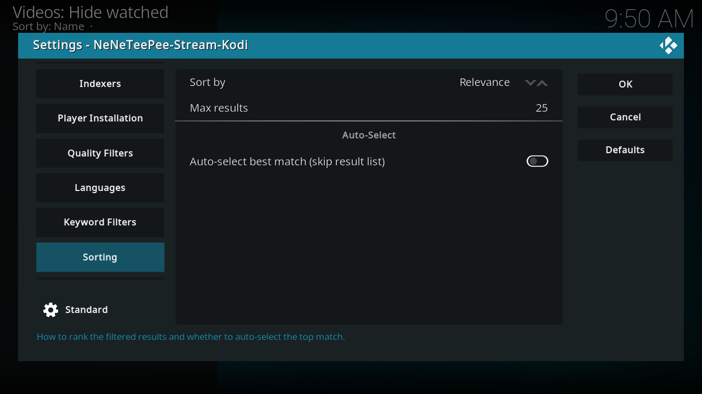

# Sorting

Relevance orders the filtered results by resolution, HDR, Hybrid REMUX / REMUX, preferred release-group tier, audio, and size. Dolby Vision ranks before HDR10+, HDR/HDR10, HLG, and SDR or unknown within a resolution. The size and age modes sort by their selected property instead. Max results limits provider requests and, when positive, the filtered picker; the show-all picker view is not truncated. Auto-select plays the best surviving result, but opens the picker if no result passed your filters. Local filters and ranking also apply to StreamNZB results, but StreamNZB always opens the picker and ignores Auto-select.

## Kodi screenshots

Captured on the OrbStack Kodi VM from commit `db07f61`. Debug overlays are off, and credentials use example values. [Capture details](index.md#capture-details).

## Every option

### Options

| Option and setting ID | Default | What it does |
| --- | --- | --- |
| Sort by[^source-sort_order] `sort_order` | Relevance | Relevance ranks highest resolution first, then Dolby Vision, HDR10+, HDR/HDR10, HLG, and SDR/unknown. Ties use Hybrid REMUX, REMUX, preferred group tiers, audio, then larger size. Size and age modes sort by that property only. Choices: 0 = Relevance, 1 = Size (largest first), 2 = Size (smallest first), 3 = Age (newest first), 4 = Age (oldest first). |
| Max results[^source-max_results] `max_results` | 25 | Local provider clients clamp the request limit to 1–10000. The filtered picker uses the raw integer and truncates only when it is positive. A value of 0 requests one result per local provider but leaves the combined filtered picker unbounded; values above 10000 remain the picker limit. The show-all view is not truncated. StreamNZB owns its server search limit. |

### Auto-select

| Option and setting ID | Default | What it does |
| --- | --- | --- |
| Auto-select best match (skip result list)[^source-auto_select_best] `auto_select_best` | Off | For nzbdav / InfiniDysk and NZBGet, play the best result that passes the filters without opening the picker. If no result passes, open the picker. StreamNZB always opens the picker and ignores this switch. |

## Source notes

Labels and schema defaults are from commit [`db07f61`](https://github.com/Appz4Fun/NeNeTeePee-Stream-Kodi/blob/db07f61d4090a0c89ec8461ee9b3ca34f9607aa6/repo/plugin.video.nzbdav/resources/settings.xml). Runtime limits can differ from the editable schema; the explanations identify those limits. Links use the full commit ID, so later changes to `main` do not move them.

[^source-sort_order]: [Setting declaration](https://github.com/Appz4Fun/NeNeTeePee-Stream-Kodi/blob/db07f61d4090a0c89ec8461ee9b3ca34f9607aa6/repo/plugin.video.nzbdav/resources/settings.xml#L1308); [runtime reference](https://github.com/Appz4Fun/NeNeTeePee-Stream-Kodi/blob/db07f61d4090a0c89ec8461ee9b3ca34f9607aa6/repo/plugin.video.nzbdav/resources/lib/filter.py#L228).
[^source-max_results]: [Setting declaration](https://github.com/Appz4Fun/NeNeTeePee-Stream-Kodi/blob/db07f61d4090a0c89ec8461ee9b3ca34f9607aa6/repo/plugin.video.nzbdav/resources/settings.xml#L1322); [runtime reference](https://github.com/Appz4Fun/NeNeTeePee-Stream-Kodi/blob/db07f61d4090a0c89ec8461ee9b3ca34f9607aa6/repo/plugin.video.nzbdav/resources/lib/direct_indexers.py#L293).
[^source-auto_select_best]: [Setting declaration](https://github.com/Appz4Fun/NeNeTeePee-Stream-Kodi/blob/db07f61d4090a0c89ec8461ee9b3ca34f9607aa6/repo/plugin.video.nzbdav/resources/settings.xml#L1331); [runtime reference](https://github.com/Appz4Fun/NeNeTeePee-Stream-Kodi/blob/db07f61d4090a0c89ec8461ee9b3ca34f9607aa6/repo/plugin.video.nzbdav/resources/lib/router_play.py#L355).

The [picker limit](https://github.com/Appz4Fun/NeNeTeePee-Stream-Kodi/blob/db07f61d4090a0c89ec8461ee9b3ca34f9607aa6/repo/plugin.video.nzbdav/resources/lib/filter.py#L505) is separate from the provider request clamps.
